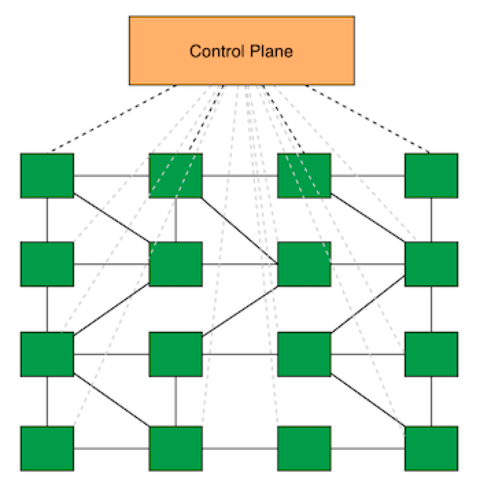
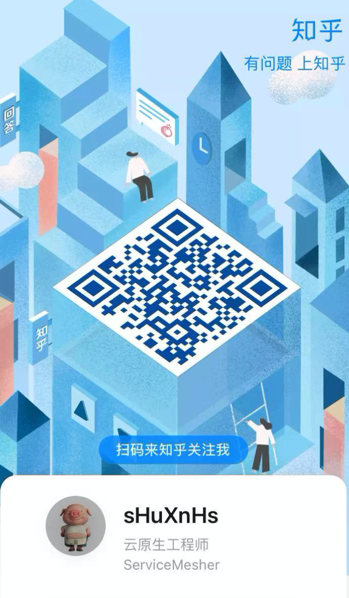
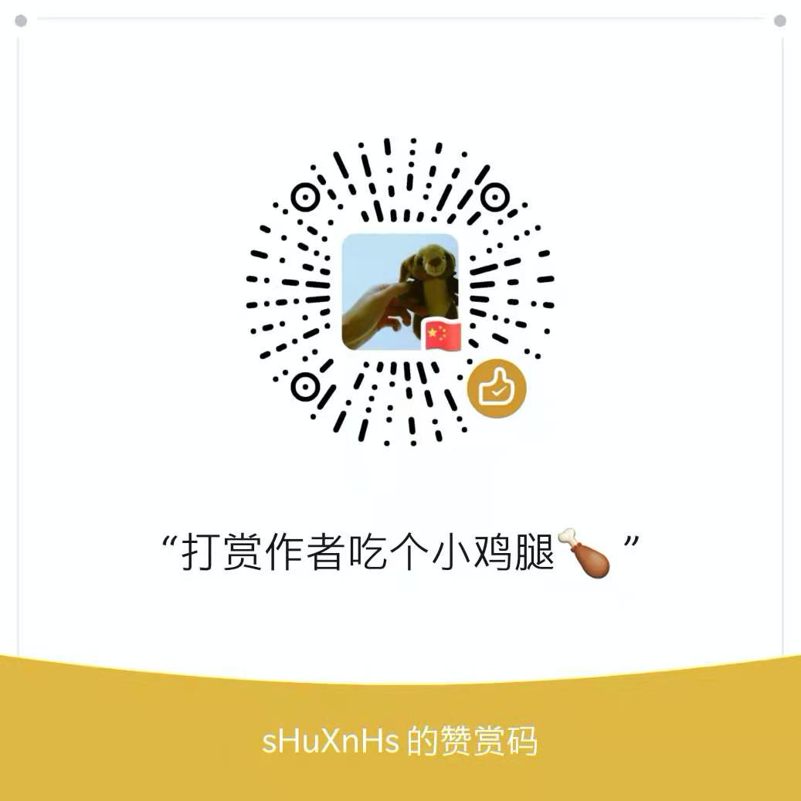

# Mastering-ServiceMesh——深入浅出服务网格

## 🏃 ‍Quick Start

> `ServiceMesh`是一项新兴技术，是下一代微服务技术的代名词。是一个用于处理服务和服务之间通信的基础设施层，
> 通过sidecar模式取代了原本在SDK处理的逻辑，以透明代理的形式提供了安全，快速，可靠的服务间通信。

Istio+Envoy作为服务网格的明星代表，慢慢的成为了服务网格的数据面与控制面的标准。在云原生时代，作为下承`Kubernetes`
上接`Serverless`架构的重要基础设施层。ServiceMesh本身涉及的内容非常多，包括了容器，网关等等相关的知识点，上手
学习也有一定的门槛。所以在本书中，我会带着大家从零开始入门学习最新版本Istio，跟着大家一起阅读分析Istio的源码和设计，并结合一些
实际的例子， 拔开ServiceMesh云雾，帮助大家上手并更好的落地实践ServiceMesh！

## 📖 Read && Discuss

+ 在线阅读:
    - [https://shuxnhs.github.io/Mastering-ServiceMesh/](https://shuxnhs.github.io/Mastering-ServiceMesh/)
    - [https://shuxnhs.gitee.io/mastering-servicemesh/](https://shuxnhs.gitee.io/mastering-servicemesh/)

+ Istio官方中文文档地址：[https://istio.io/latest/zh/docs/concepts/what-is-istio/](https://istio.io/latest/zh/docs/concepts/what-is-istio/)

+ Envoy官方地址：[https://www.envoyproxy.io/docs/envoy/latest/](https://www.envoyproxy.io/docs/envoy/latest/)

+ 云原生社区 Istio Handbook：[https://www.servicemesher.com/istio-handbook/](https://www.servicemesher.com/istio-handbook/) 

+ 云原生社区翻译的Envoy中文文档地址：[https://www.servicemesher.com/envoy/](https://www.servicemesher.com/envoy/)

+ 赵化冰大神 Istio-Practice文档地址： [https://zhaohuabing.com/istio-practice/](https://zhaohuabing.com/istio-practice/)
  
+ 参与讨论：欢迎大家一起来分享大家在服务网格知识，案例，困惑，遇到的难题等

## 🎁 Share

欢迎大家关注我的知乎，更多小知识也会分享在我的知乎！

## 🌟 Reward
作者整理这么多资料，好饿哦～希望大家能随手点点关注点点星星star，或者给作者加个鸡腿哈😍

