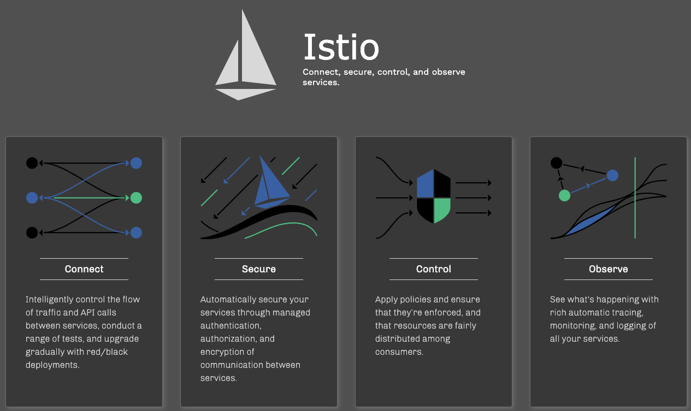
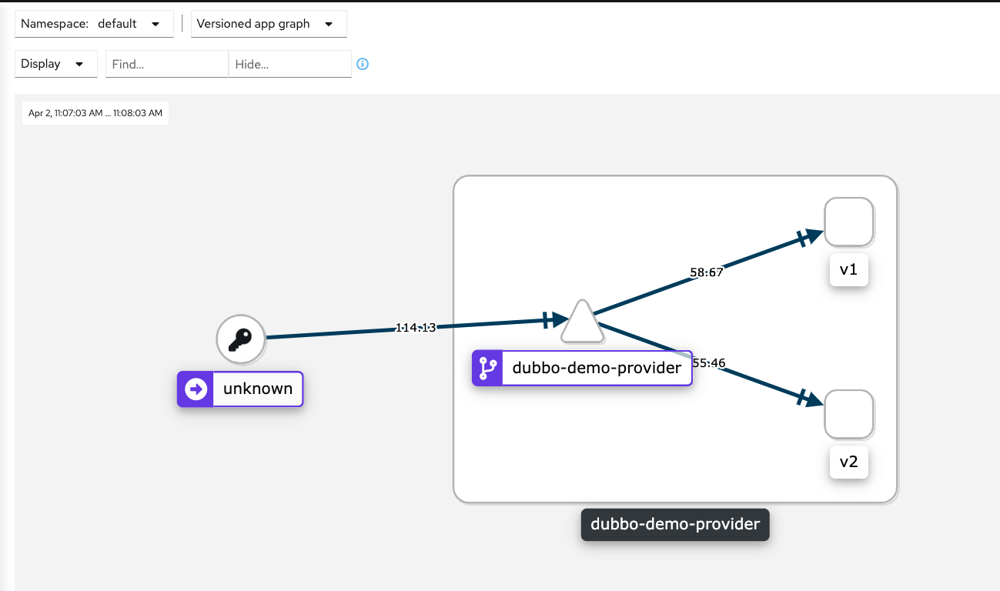
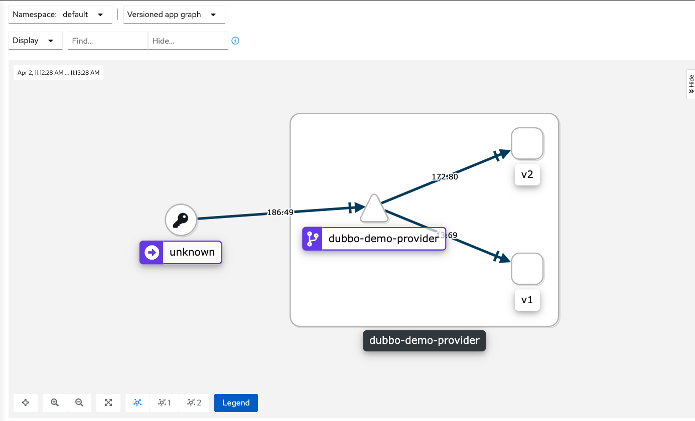

# 使用istio管理dubbo服务


## Istio是什么

Istio，希腊语，意思就跟他的图标一样，意扬帆起航。据说作者为了取名，翻阅了几个小时的希腊字段，主要是为了沿用k8s建立的航海主题，帆船与船舵相互配合才能扬帆起航。


官方对 Istio 的介绍浓缩成了一句话：*An open platform to connect, secure, control and observe services.* 可以说Istio是用来处理服务间通信的基础设施层，这个简介也介绍了Istio的四个重要的功能：

+ Connect： 控制服务间的调用流量，能够实现灰度升级，蓝绿，AB测试等功能
+ Secure：可以为服务间的调用提供认证，授权，加密
+ Control：用户自定义policy对资源的公平分配
+ Observe：健壮的追踪，监控和日志深入了解服务的运行，性能情况




经过Istio社区的演进和迭代，Istio已经慢慢开始可以应用于生产，比如：

+ 国内的阿里云，腾讯云，华为云等公有云均提供了托管Istio，提供开箱即用的解决方案。此时如果你的业务跑在公有云中，可以考虑直接使用ASM托管服务

+ 网易轻舟 Service Mesh 开源的slime，针对istio的CRD控制器可以通过简单配置实现自动更便捷的使用istio/envoy高阶功能。

+ Service-mesh支撑了扇贝所有微服务百万日活场景

  

对于Java的开发者来说，dubbo也是一个非常流行的微服务框架，如何将dubbo服务通过k8s和istio部署与管理是个问题。本文介绍下一种dubbo与istio共生方法，并进行流量管理的例子。


## customer

首先建立一个简单的customer，main函数主要是定时去调用provider的sayHello方法

```java
package com.alibaba.dubbo.demo.consumer;

import com.alibaba.dubbo.demo.DemoService;
import org.springframework.context.support.ClassPathXmlApplicationContext;

import java.util.Date;

public class Consumer {
    public static void main(String[] args) {
        System.setProperty("java.net.preferIPv4Stack", "true");
        ClassPathXmlApplicationContext context = new ClassPathXmlApplicationContext(new String[]{"META-INF/spring/dubbo-demo-consumer.xml"});
        context.start();
        // get remote service proxy
        DemoService demoService = (DemoService) context.getBean("demoService");
        while (true) {
            try {
                Thread.sleep(5000);
                // call remote method
                String hello = demoService.sayHello("world");
                // get result
                System.out.println(hello + "-" + new Date());
            } catch (Throwable throwable) {
                throwable.printStackTrace();
            }
        }
    }
}
```

附上customer的xml配置

```xml
<?xml version="1.0" encoding="UTF-8"?>
<beans xmlns:xsi="http://www.w3.org/2001/XMLSchema-instance"
       xmlns:dubbo="http://dubbo.apache.org/schema/dubbo"
       xmlns="http://www.springframework.org/schema/beans"
       xsi:schemaLocation="http://www.springframework.org/schema/beans http://www.springframework.org/schema/beans/spring-beans-4.3.xsd
       http://dubbo.apache.org/schema/dubbo http://dubbo.apache.org/schema/dubbo/dubbo.xsd">

    <!-- consumer's application name, used for tracing dependency relationship (not a matching criterion),
    don't set it same as provider -->
    <dubbo:application name="demo-consumer"/>

    <!-- use multicast registry center to discover service -->
    <dubbo:registry address="multicast://224.5.6.7:1234" register="false"/>

    <!-- url要写上provider在istio运行的服务名字 -->
    <dubbo:reference id="demoService" check="false" interface="com.alibaba.dubbo.demo.DemoService"
                     url="dubbo://dubbo-demo-provider:20880"/>

</beans>
```

使用maven打包后放进tomcat的镜像

```shell
mvn clean && mvn package -Dmaven.test.skip=true
```

Dockerfile示例

```dockerfile
FROM tomcat
COPY dubbo-demo-consumer.jar dubbo-demo-consumer.jar
RUN cd /usr/local/tomcat/bin/
ENV JAVA_OPTS="-Xms2048m -Xmx2048m "
ENTRYPOINT [ "sh", "-c", "java $JAVA_OPTS -jar dubbo-demo-consumer.jar" ]
```

我已经打包好一个镜像，镜像地址：shuxnhs/dubbo-mesh-consumer:v1.1


## provider

同样创建一个简单的provider，实现下sayHello方法

v1版本返回：Hello world, response from provider: ip

v2版本返回：Hello world, I'm V2,  response from provider: ip

```java
package com.alibaba.dubbo.demo.provider;

import com.alibaba.dubbo.demo.DemoService;
import com.alibaba.dubbo.rpc.RpcContext;

import java.text.SimpleDateFormat;
import java.util.Date;

public class DemoServiceImpl implements DemoService {
    @Override
    public String sayHello(String name) {
        return "Hello " + name + ", I'm V2, response from provider: " + RpcContext.getContext().getLocalAddress();
    }
}
```

附上provider的xml配置

```xml
<?xml version="1.0" encoding="UTF-8"?>
<beans xmlns:xsi="http://www.w3.org/2001/XMLSchema-instance"
       xmlns:dubbo="http://dubbo.apache.org/schema/dubbo"
       xmlns="http://www.springframework.org/schema/beans"
       xsi:schemaLocation="http://www.springframework.org/schema/beans http://www.springframework.org/schema/beans/spring-beans-4.3.xsd
       http://dubbo.apache.org/schema/dubbo http://dubbo.apache.org/schema/dubbo/dubbo.xsd">

    <!-- provider's application name, used for tracing dependency relationship -->
    <dubbo:application name="demo-provider"/>

    <!-- use multicast registry center to export service -->
    <dubbo:registry address="multicast://224.5.6.7:1234" register="false"/>

    <!-- use dubbo protocol to export service on port 20880 -->
    <dubbo:protocol name="dubbo" port="20880"/>

    <!-- service implementation, as same as regular local bean -->
    <bean id="demoService" class="com.alibaba.dubbo.demo.provider.DemoServiceImpl"/>

    <!-- declare the service interface to be exported -->
    <dubbo:service interface="com.alibaba.dubbo.demo.DemoService" ref="demoService"/>

</beans>
```

同样方法打包镜像

v1版本provider： shuxnhs/dubbo-mesh-provider:v1.0 

v2版本provider： shuxnhs/dubbo-mesh-provider:v2.0  


## Istio中部署注入

1. customer.yaml

   ```yaml
   apiVersion: apps/v1
   kind: Deployment
   metadata:
     name: dubbo-demo-consumer-deployment
   spec:
     replicas: 4
     selector:
       matchLabels:
         app: dubbo-demo-consumer
     template:
       metadata:
         name: dubbo-demo-consumer
         labels:
           app: dubbo-demo-consumer
       spec:
         containers:
           - name: dubbo-demo-consumer
             image: shuxnhs/dubbo-mesh-consumer:v1.1
             imagePullPolicy: Always
             command: [ "sh", "-c", "java $JAVA_OPTS -jar dubbo-demo-consumer.jar " ]
   ```

2. Provider.yaml

   ```yaml
   apiVersion: apps/v1
   kind: Deployment
   metadata:
     name: dubbo-demo-provider-deployment-v1
   spec:
     replicas: 1
     selector:
       matchLabels:
         app: dubbo-demo-provider
         version: v1
     template:
       metadata:
         name: dubbo-demo-provider
         labels:
           app: dubbo-demo-provider
           version: v1
       spec:
         containers:
           - name: dubbo-demo-provider
             image: shuxnhs/dubbo-mesh-provider:v1.0
             imagePullPolicy: Always
             command: [ "sh", "-c", "java $JAVA_OPTS -jar dubbo-demo-provider.jar " ]
   
   ---
   apiVersion: apps/v1
   kind: Deployment
   metadata:
     name: dubbo-demo-provider-deployment-v2
   spec:
     replicas: 1
     selector:
       matchLabels:
         app: dubbo-demo-provider
         version: v2
     template:
       metadata:
         name: dubbo-demo-provider
         labels:
           app: dubbo-demo-provider
           version: v2
       spec:
         containers:
           - name: dubbo-demo-provider
             image: shuxnhs/dubbo-mesh-provider:v2.0
             imagePullPolicy: Always
             command: [ "sh", "-c", "java $JAVA_OPTS -jar dubbo-demo-provider.jar " ]
   
   ---
   apiVersion: v1
   kind: Service
   metadata:
     name: dubbo-demo-provider
     labels:
       app: dubbo-demo-provider
   spec:
     ports:
       - name: dubbo
         protocol: TCP
         port: 20880
         targetPort: 20880
     selector:
       app: dubbo-demo-provider
   ```

3. istioctl注入

   ```shell
   istioctl kube-inject -f customer.yaml | kubectl apply -f -
   istioctl kube-inject -f provider.yaml | kubectl apply -f -
   ```


4. 创建对应的VirtualService和DestinationRule对dubbo的流量进行控制，对两个provider分v1和v2版本，对将流量各自50%

   ```yaml
   apiVersion: networking.istio.io/v1beta1
   kind: VirtualService
   metadata:
     name: dubbo-demo-provider-route
   spec:
     hosts:
       - dubbo-demo-provider
     tcp:
       - route:
           - destination:
               host: dubbo-demo-provider
               port:
                 number: 20880
               subset: v2
             weight: 50
           - destination:
               host: dubbo-demo-provider
               port:
                 number: 20880
               subset: v1
             weight: 50
   ---
   apiVersion: networking.istio.io/v1beta1
   kind: DestinationRule
   metadata:
     name: dubbo-demo-provider-destination
   spec:
     host: dubbo-demo-provider
     subsets:
       - name: v1
         labels:
           version: v1
       - name: v2
         labels:
           version: v2
   ```

   

5. 查看kiali

  

  

6. 调整各自的权重为90%和10%，重启constomer

   


## 总结展望

Istio的功能很强大，如果将dubbo服务迁移到istio，即需要将dubbo的流量治理等能力下沉到Istio去处理，把dubbo即变成一个普通的服务，而且改造的过程也面临了几个问题：

1. 私有协议的问题，在istio中http是一等公民，即使最新的envoy支持dubbo协议，但是还需要通过envoyFilter下发专属的xDS协议数据来支持Dubbo的服务调用与流量治理
2. 轻量改造dubbo，去掉dubbo的注册中心，这样虽然可以将dubbo服务运行在istio中但无法完整的使用istio的流量管理或链路追踪
3. 改造成SpringBoot项目，需要调整代码的结构，但是可以最大化的利用istio的服务治理能力

Dubbo服务迁移上Istio的工作还是任重而道远，在真实的业务系统中的架构复杂度很大，不是上述demo这种hello-world小例子能比，实际的改造难度是很大的。或许未来的某一天Istio社区或者dubbo社区会提供一个完美的解决方案，但K8s+Istio是未来微服务架构的方向这是毋庸置疑的。