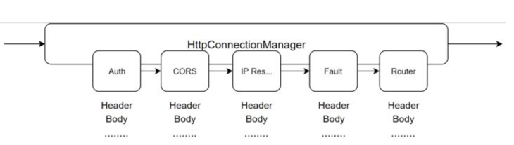

# Envoy基本概念

### Downstream & Upstream

downstream/upstream与nginx中的上下游概念一致。下游（downstream）可以理解为envoy的客户端，下游主机连接到 Envoy，发送请求并接收响应；上游（upstream）则可以理解为envoy的服务端，上游主机接收来自 Envoy 的连接和请求，并返回响应。

### Cluster

集群（cluster）是指 Envoy 连接到的逻辑上相似的一组上游（upstream）集合。Envoy 通过服务发现来发现集群的成员；通过主动健康检查来确定集群成员的健康状态；通过负载均衡策略决定将请求路由到哪个集群成员。

### Endpoint 

端点（Endpoint）来表示一个应用实例，对应一个IP+Port的组合。

### Listener

监听器（listener）是可以由下游客户端（downstream）连接的命名网络位置（例如，端口、unix domain socket等)。Envoy 暴露一个或者多个监听器给下游主机连接。在Envoy中，Listener可以绑定到端口上直接对外服务，也可以不绑定到端口上，而是接收其他listener转发的请求。一般是每台主机运行一个 Envoy，使用单进程运行，但是每个进程中可以启动任意数量的 Listener（监听器），目前只监听 TCP，每个监听器都独立配置一定数量的（L3/L4）网络过滤器。Listenter 也可以通过 Listener Discovery Service（**LDS**）动态获取。

### Filter

envoy中的插件概念，主要可以分为几种：

+ **Listener Filter**：Listener Filter在连接建立之后，首先被执行处理，但是由于Listener Filter只能获得极少数的信息（remote address），所以在此进行的操作极少。

+ **Network Filter**：Network Filter是在Listener Filter处理完成之后开始执行的插件。其工作在四层，Network Filter可以获取相对更加丰富的信息，但是也非常有限。Network Filter是envoy管理各种协议和流量的基础，通过扩展Network Filter，可以实现envoy对各种不同类型流量的治理，如Dubbo、redis、MQ等等。

  >在所有的四层插件之中，HttpConnectionManager负责处理HTTP协议的四层流量。该插件是Envoy强大的能力的基础，可以说是整个Envoy中最为重要的插件。

+ **Http Filter**： Http Filter是HttpConnectionManager插件下的一系列子插件，HttpConnectionManager插件在完成HTTP数据解析之后，会依次调用Http Filter提供的接口，对HTTP数据做进一步处理（如替换header、限流、错误注入、缓存等等）。Envoy丰富而强大的功能，很多都是依赖Http Filter插件来实现。大部分情况下，在对Envoy做扩展增强时，也是通过扩展Http Filter来做到。

  

  > ROUTER是HttpConnectionManager不可缺少的一个插件，是HTTP路由的基础，所有的HTTP请求都最终由Router插件向上游服务发送。Router支持常见的路由匹配（前缀匹配、精确匹配、正则匹配）、前缀重写、重定向、直接返回、分流、header添加与移除等等。

+ **Access log filters**： 对access log做一些个性化定制处理。

### Filter-Chains

从 socket 中收取的请求先经过 listener_filters处理，然后再由 filter_chains 处理。每个插件就像是链条上的小铜球，所以之后的 filter 称为 Filter-Chains。

### XDS

xDS 协议是 “X Discovery Service”的简写，这里的 “X” 表示它不是指具体的某个协议，是一组基于不同数据源的服务发现协议的总称，包括 CDS、LDS、EDS、RDS 和 SDS 等。客户端可以通过多种方式获取数据资源，比如监听指定文件、订阅 gRPC stream 以及轮询相应的 REST API 等。

|  服务简写  |              全称            |                描述                 |
| :------: | :--------------------------: | :--------------------------------: |
|   LDS    |  Listener Discovery Service  |            监听器发现服务             |
|   RDS    | Route Discovery Service      |             路由发现服务             |
|   CDS    | Cluster Discovery Service    |             集群发现服务             |
|   EDS    | Endpoint Discovery Service   |           集群成员发现服务            |
|   SDS    | Service Discovery Service    | v1 时的集群成员发现服务，后改名为 EDS   |
|   ADS    | Aggregated Discovery Service |             聚合发现服务              |
|   HDS    | Health Discovery Service     |            健康度发现服务             |
|   SDS    | Secret Discovery Service     |             密钥发现服务              |
|    MS    | Metric Service               |             指标发现服务              |
|   RLS    | Rate Limit Service           |             限流发现服务              |
|   xDS    |                              |          以上各种 API 的统称          |

### WebAssembly

原本 WASM （WebAssembly）作为前端技术，只被嵌入在浏览器内核中，用于加速 Web 应用。但是 Envoy社区提出将 WASM 技术引入到后端代理中，使得 WASM 的种种优异特性也能够为 API 网关，为 Service Mesh 编写插件，增强其可扩展性。

### data-plane-api

[github传送门](https://github.com/envoyproxy/data-plane-api/)，定义了envoy 的 REST API 和配置下发时使用的通信协议 [xDS REST and gRPC protocol](https://www.envoyproxy.io/docs/envoy/latest/api-docs/xds_protocol)

### go-control-plane

[github传送门](https://github.com/envoyproxy/go-control-plane), envoy提供的控制面开发框架，使用该框架可以快速开发一个控制平面（也就是 xDS 服务），框架已经实现了通信过程，不需要自行实现通信协议。

