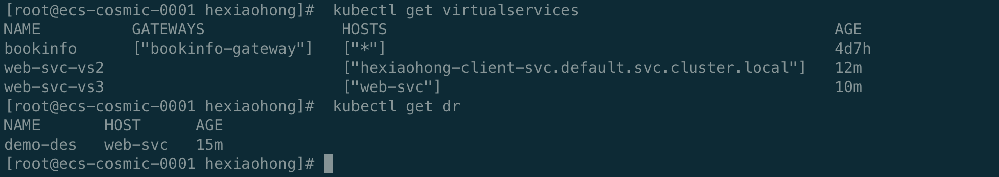
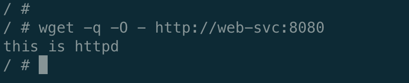
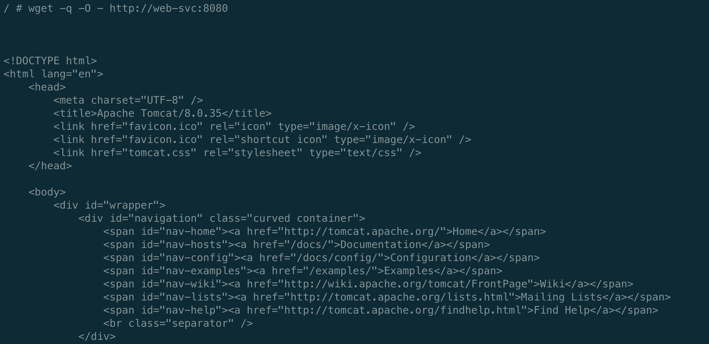

# Istio学习之CRD2⃣️：DestinationRule


今天来学习Istio关于流量管理的另一个CRD——DestinationRule，根据字面意思即目标规则，我们可以理解VirtualService为流量的路由，那么DestinationRule则为流量路由之后的去处。


### 介绍

1. 首先献上官方文档：https://istio.io/latest/zh/docs/reference/config/networking/destination-rule/

2. 样例

   ```yaml
   apiVersion: networking.istio.io/v1alpha3
   kind: DestinationRule
   metadata:
     name: bookinfo-ratings
   spec:
   	# 含义同VirtualService中destination的host字段一致。
     host: ratings.prod.svc.cluster.local
     # 流量策略，包括负载均衡、连接池策略、异常点检查等
     trafficPolicy:
     	# 负载均衡策略，支持随机负载均衡 /按权重负载均衡 /最少请求负载均衡 / hash轮训等
       loadBalancer:
         simple: LEAST_CONN
       # 连接池策略
       connectionPool:
       	# tcp连接池设置
         tcp:
           maxConnections: 100
           connectTimeout: 30ms
           tcpKeepalive:
             time: 7200s
             interval: 75s
         http:
           http2MaxRequests: 1000
           maxRequestsPerConnection: 10
       # 异常点检查
       outlierDetection:
         consecutiveErrors: 7
         interval: 5m
         baseEjectionTime: 15m
       # tls设置
       tls:
         mode: MUTUAL
         clientCertificate: /etc/certs/myclientcert.pem
         privateKey: /etc/certs/client_private_key.pem
         caCertificates: /etc/certs/rootcacerts.pem
     # 服务端点集合
     subsets:
     # subset名称可以用于路由规则中的流量拆分，与virtualService的subset的引用
     - name: testversion
     	# 使用标签对服务注册表中的服务端点进行筛选
       labels:
         version: v3
       trafficPolicy:
         loadBalancer:
           simple: ROUND_ROBIN
   ```

   

3. 作用：我们可以通过结合virtualService，使用 Destination Rule 对流量划分不同的子集，根据不同的条件比如用户不同的身份、地址位置等条件的识别后的进行不同的流量路由，或者在版本更新的时候，使用灰度发布。
4. VirtualService对象和DestinationRule对象既可以单独使用、也可以结合使用。功能上VirtualService的功能之一是在后端不同Service中选择一个转发请求，而Service是在后端不同Pod中选择一个转发请求。DestinationRule是对不同后端的同一个Service上进行划分不同的subset。VirtualService和DestinationRule是通过subnet关联起来的。

### 演示

还是以上次VirtualService的httpd和tomcat例子为演示，首先创建对应的Deployment

+ httpd

  ```yaml
  apiVersion: apps/v1
  kind: Deployment
  metadata:
    name: httpd
    labels:
      server: httpd
      app: web
  spec:
    replicas: 1
    selector:
      matchLabels:
        server: httpd
        app: web
    template:
      metadata:
        labels:
          server: httpd
          app: web
      spec:
        containers:
        - name: busybox
          image: busybox
          imagePullPolicy: IfNotPresent
          command: ["/bin/sh", "-c", "echo 'this is httpd' > /var/www/index.html; httpd -f -p 8080 -h /var/www"]
  ```

+ tomcat

  ```yaml
  apiVersion: apps/v1
  kind: Deployment
  metadata:
    name: tomcat
    labels:
      server: tomcat
      app: web
  spec:
    replicas: 1
    selector:
      matchLabels:
        server: tomcat
        app: web
    template:
      metadata:
        labels:
          server: tomcat
          app: web
      spec:
        containers:
        - name: tomcat
          image: docker.io/kubeguide/tomcat-app:v1
          imagePullPolicy: IfNotPresent
  ```


+ 创建对应的service

  ```yaml
  apiVersion: v1
  kind: Service
  metadata:
    name: web-svc
  spec:
    selector:
      app: web
    ports:
    - name: http
      port: 8080
      targetPort: 8080
      protocol: TCP
  ```

+ 使用DestinationRule根据label将我们的流量划分为不同的版本，假设把httpd为我们服务的v1版本，tomcat为v2版本，使用VirtualService进行不同的路由

  ```yaml
  apiVersion: networking.istio.io/v1alpha3
  kind: DestinationRule
  metadata:
    name: demo-des
  spec:
    host: web-svc
    subsets:
    - name: v1
      labels:
        server: httpd
    - name: v2
      labels:
        server: tomcat
    
    
  ---
  apiVersion: networking.istio.io/v1alpha3
  kind: VirtualService
  metadata:
    name: web-svc-vs3
  spec:
    hosts:
    - web-svc
    http:
    - route:
      - destination:
          host: web-svc
          subset: v2
  ```

+ 创建busybox进入测试

  ```yaml
  apiVersion: apps/v1
  kind: Deployment
  metadata:
    name: hexiaohong-client
  spec:
    replicas: 1
    selector:
      matchLabels:
        app: hexiaohong-client
    template:
      metadata:
        labels:
          app: hexiaohong-client
      spec:
        containers:
        - name: busybox
          image: busybox
          imagePullPolicy: IfNotPresent
          command: ["/bin/sh", "-c", "sleep 3600"]
  
  ---
  apiVersion: v1
  kind: Service
  metadata:
    name: hexiaohong-client-svc
  spec:
    selector:
      app: hexiaohong-client
    ports:
    - name: http
      port: 8080
      targetPort: 8080
      protocol: TCP
  ```

+ 查看virtualService与DestinationRule

  

+ 进入busybox 请求

  

+ 使用kubectl edit  virtualservices XXX，修改subset的版本为v2，进入busybox请求，流量则导入到v2/tomcat去了

  


