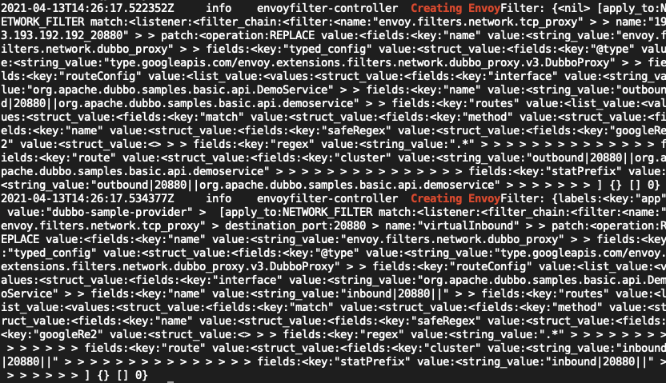

# Istio学习之CRD4⃣️：EnvoyFilter

Istio中的流量配置是由Pilot统一下发给Envoy，它本身是无状态的，所以所有的资源配置都是以CRD保存在k8s集群。每次控制面与数据面的连接建立之后，Pilot会以事件通知机制出发推送给Envoy。但是由于配置是统一下发的，所以Istio对私有协议或者拓展Envoy的配置能力不足，所以Istio提供了EnvoyFilter用来更新Envoy中的filter，让控制面具有更强大的拓展性，能够自定义Envoy中的filter-chains。


## 介绍

1. 官方文档[传送门](https://istio.io/latest/zh/docs/reference/config/networking/envoy-filter/#EnvoyFilter-Patch)
2. EnvoyFilter的配置会直接的影响Envoy中的filter chains，所以要谨慎使用。如果配置了错误的内容下发envoy，可能会令整个服务网格无法使用
3. 介绍

```yaml
apiVersion: networking.istio.io/v1alpha3
kind: EnvoyFilter
metadata:
  name: custom-protocol
  # as defined in meshConfig resource,支持了命名空间的ge li
  namespace: istio-config
spec:
	workloadSelector:
    labels:
      istio: ingress-gateway
  configPatches:
  # 作用于envoy LISTENER / FILTER_CHAIN / NETWORK_FILTER / CLUSTER等
  - applyTo: NETWORK_FILTER
    match:
    	 # will match outbound listeners in all sidecars(ANY \ SIDECAR_INBOUND \ SIDECAR_OUTBOUND \ GATEWAY)
      context: SIDECAR_OUTBOUND
      listener:
        portNumber: 9307
        filterChain:
          filter:
            name: "envoy.tcp_proxy"
    patch:
    	// 对匹配的fiter的操作， MERGE、ADD、REMOVE、INSERT_BEFORE、INSERT_AFTER
      operation: INSERT_BEFORE
      // struct，envoy对应对象需要的配置，参考envoy具体的配置：https://www.envoyproxy.io/docs/envoy/latest/configuration/configuration
      value:
        name: "envoy.config.filter.network.custom_protocol"
        typed_config:
          "@type": "type.googleapis.com/envoy.config.filter.network.http_connection_manager.v2.HttpConnectionManager"
          idle_timeout: 30s
```


## 应用

aeraki就是通过对EnvoyFilter的自动创建与维护，生成对应的envoyFilter配置推送到Istio中，实现对Istio的拓展支持。比如我们使用aeraki去实现dubbo服务的服务网格流量管理，根据规则创建对应的crd之后，通过aeraki的日志我们可以看到，aeraki帮我们创建了对应的EnvoyFilter，实现了对dubbo协议的支持，具体案例参考：[Aeraki应用示例](../../istio-ecology/aeraki/case.md)



