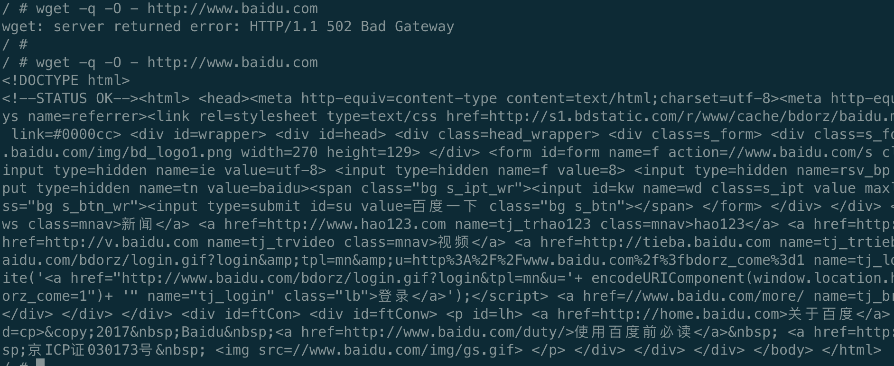

# Istio学习之CRD3⃣️：ServiceEntry

服务网格中的工作负载想要访问网格外的服务时，有以下三种方法：

1. 允许Envoy代理将请求透传到未在网格内部配置的服务（默认，通常情况下配置更严格的控制是更可取的）
2. 配置 ServiceEntry以提供对外部服务的受控访问。
3. 对于特定范围的IP，使用`global.proxy.includeIPRanges`配置完全绕过Envoy代理。

本篇主要来介绍一下OutboundTrafficPolicy.Mode的设置，ServiceEntry的使用与概念。


## 介绍

1. 首先还是献上官方文档：https://istio.io/latest/docs/reference/config/networking/service-entry/

2. 样例

   ```yaml
   apiVersion: networking.istio.io/v1alpha3
   kind: ServiceEntry
   metadata:
     name: external-svc-mongocluster
   spec:
     # DNS名称
     hosts:
     - mymongodb.somedomain # not used
     addresses:
     - 192.192.192.192/24 # VIPs
     # 关联的端口
     ports:
     - number: 27018
       name: mongodb
       # 端口协议：HTTP, HTTPS, HTTP2, GRPC, MONGO, TCP或TLS
       protocol: MONGO
     # 网格的角度，内部 or 外部服务，MESH_INTERNAL / MESH_EXTERNAL
     location: MESH_INTERNAL
     # 主机的服务发现模式： NONE / STATIC / DNS
     resolution: STATIC
     # 外部服务在网格内的域名和网格外的域名不同，在 endpoints 中配置原始域名：
     endpoints:
     - address: us.foo.bar.com
       ports:
         https: 8080
     - address: uk.foo.bar.com
       ports:
         https: 9080
   ```


## 演示

+ 首先查看istio的外部服务的访问控制配置，即*MeshConfig.OutboundTrafficPolicy.Mode*（[传送门](https://istio.io/latest/zh/docs/reference/config/istio.mesh.v1alpha1/#MeshConfig-OutboundTrafficPolicy)），默认为ALLOW_ANY，即istio的egressGateway会允许调用未知的服务，将请求透传到未在网格内部配置的服务

  ```yaml
  # 查看当前模式
  # kubectl get configmap istio -n istio-system -o yaml | grep -o "mode: ALLOW_ANY"
  mode: ALLOW_ANY
  
  # 如果没有配置模式，默认为ALLOW_ANY，可以手动添加
  outboundTrafficPolicy: 
    mode: ALLOW_ANY
  ```

+ 此时进入busybox访问www.baidu.com，可以访问成功

  

+ 修改访问模式为REGISTRY_ONLY

  ```shell
  kubectl get configmap istio -n istio-system -o yaml | sed 's/mode: ALLOW_ANY/mode: REGISTRY_ONLY/g' | kubectl replace -n istio-system -f -
  
  # 切换回Allow-all
  kubectl get configmap istio -n istio-system -o yaml | sed 's/mode: REGISTRY_ONLY/mode: ALLOW_ANY/g' | kubectl replace -n istio-system -f -
  ```

+ 此时进入busybox访问www.baidu.com，发现已经访问不了（可能需要等一段时间来使配置生效）

  

+ 创建对应的ServiceEntry服务条目，将外部资源注入到istio内部网络

  ```yaml
  apiVersion: networking.istio.io/v1beta1
  kind: ServiceEntry
  metadata:
    name: demo-se
  spec:
    hosts:
    - www.baidu.com
    location: MESH_EXTERNAL
    ports:
    - name: http
      number: 80
      protocol: HTTP
    resolution: DNS
  ```

  ```shell
  # 查看所有的serviceEntry
  # kubectl get se
  NAME      HOSTS               LOCATION        RESOLUTION   AGE
  demo-se   ["www.baidu.com"]   MESH_EXTERNAL   DNS          37s
  ```

+ 此时进入busybox再次请求，发现可以访问到

  

​	 

## 总结

1. 使用默认的Allow-all的访问外部服务控制使用简单，但缺点，即丢失了对外部服务流量的 Istio 监控和控制；比如，允许调用所有未知的外部服务，外部服务的调用没有记录到 Mixer 的日志中。
2. 在服务调用过程中会使用到外部的服务，外部服务和本身集群内的服务无任何关系，通过ServiceEntry将该服务注册到 Istio 网格，在集群内部就好像访问自身的服务一样，我们还可以结合VirtualService、DestinationRule进而对网格内调用外部服务使用一些高级的治理能力，例如限流、重试等等对服务治理能力支持。
3. 现实的世界中，并不能做到所有的业务都容器化，Istio也意识到了这个问题，所以正在支持非容器部署的业务。除了ServiceEntry，又增加了WorkloadEntry，从而支持将vm部署的业务纳入mesh中。


