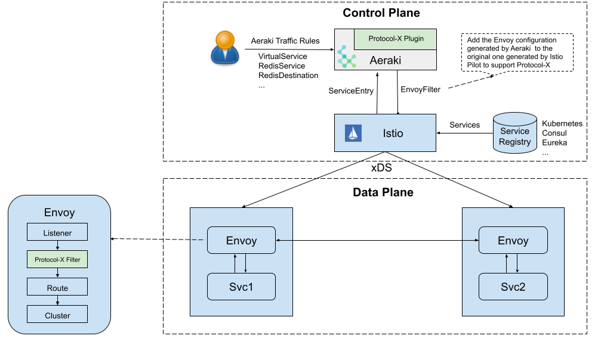

# Aeraki基本概念


## 我们为什么需要Aeraki

虽然Istio已经成为了ServiceMesh的控制面标准，但是在协议方面，只有http协议是`一等公民`。只有对与HTTP协议提供了完善的功能支持，但是在我们实际的场景中会存在着许多其他的私有协议，但是我们只能被迫使用TCP协议来进行基本的请求路由或者透传，无法发挥出Istio强大的流量管理等功能。

虽然我们可以通过一些方式来拓展Istio，比如我们可以通过修改Istio代码来实现新的协议处理和下发，接着你还需要在Pilot修改 xds 代码库的协议，根据我们的服务定义和路由规则下发给Envoy，最后你还要在 Envoy 中实现相应的 Filter 来完成协议的解析和路由等功能。但是如果这样的话我们就需要自己维护一个Istio的私有分支，同时也要兼容和同步Istio社区的代码迭代，成本也非常大。

Aeraki则是一个Istio的协议拓展插件，可以帮助我们根据`ServiceEntry`和 Aeraki 流量规则生成 Envoy 配置，并采用 EnvoyFilter 将生成的配置推送到 Istio 中，以这种无侵入方式来拓展Istio对其他七层私有协议支持。


## Aeraki介绍

`Aeraki`在希腊语中是“微风”，作者希望通过 Aeraki 这股微风能帮助 Istio 在云原生的旅程中航行得更远。github传送门: [aeraki](https://github.com/aeraki-framework/aeraki)




Aeraki是控制面的一个独立组件，会自动生成协议相关的缺省配置，减少了我们手工创建和维护EnvoyFilter的工作。对与Dubbo和Thrift可以采用`virtualService`和`DestinationRule` 这些Istio原生的CRD去管理；而对于其他的非RPC协议，Aeraki定义了一些新的CRD去管理类似redis的服务。


## 安装

1. 官方提供了对应的安装脚本，执行即可获得带有Aeraki插件的Istio集群和对应的Demo程序。

   ```
   aeraki/demo/install-demo.sh
   ```

2. 如果已经有了Istio环境，只想安装aeraki插件，将将install-demo换成下面脚本

   ```
   BASEDIR=$(dirname "$0")
   
   SCRIPTS_DIR=$BASEDIR/test/e2e/scripts
   COMMON_DIR=$BASEDIR/test/e2e/common
   export ISTIO_VERSION=1.9.1
   export BUILD_TAG=latest
   
   bash ${SCRIPTS_DIR}/aeraki.sh
   
   # 部署我们需要的对应的样例
   #bash $BASEDIR/demo/dubbo/install.sh
   #bash $BASEDIR/demo/thrift/install.sh
   #bash ${BASEDIR}/demo/kafka/install.sh
   ```

> `Aeraki`的`dubbo demo`需要 `istio` 开启DNS解析功能，安装需要开启
> ```shell
> istioctl install --set profile=demo  --set meshConfig.defaultConfig.proxyMetadata.ISTIO_META_DNS_CAPTURE='\"true\"'
> ```
   