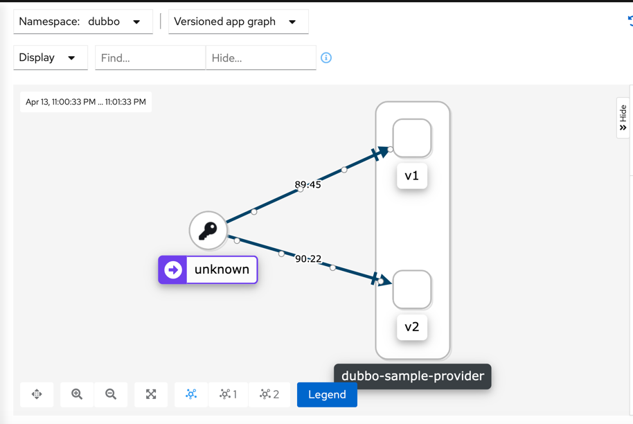
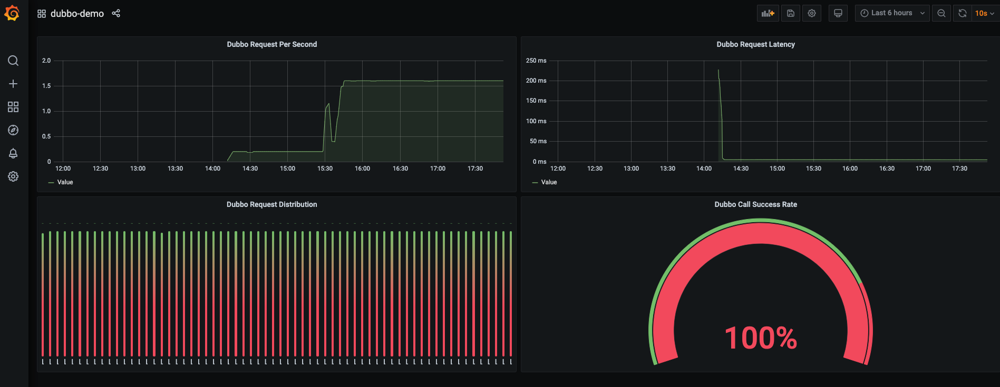

# Aeraki基本概念


## 我们为什么需要Aeraki

虽然Istio已经成为了ServiceMesh的控制面标准，但是在协议方面，只有http协议是`一等公民`。只有对与HTTP协议提供了完善的功能支持，但是在我们实际的场景中会存在着许多其他的私有协议，但是我们只能被迫使用TCP协议来进行基本的请求路由或者透传，无法发挥出Istio强大的流量管理等功能。

虽然我们可以通过一些方式来拓展Istio，比如我们可以通过修改Istio代码来实现新的协议处理和下发，接着你还需要在Pilot修改 xds 代码库的协议，根据我们的服务定义和路由规则下发给Envoy，最后你还要在 Envoy 中实现相应的 Filter 来完成协议的解析和路由等功能。但是如果这样的话我们就需要自己维护一个Istio的私有分支，同时也要兼容和同步Istio社区的代码迭代，成本也非常大。

Aeraki则是一个Istio的协议拓展插件，可以帮助我们根据`ServiceEntry`和 Aeraki 流量规则生成 Envoy 配置，并采用 EnvoyFilter 将生成的配置推送到 Istio 中，以这种无侵入方式来拓展Istio对其他七层私有协议支持。


## Aeraki介绍

`Aeraki`在希腊语中是“微风”，作者希望通过 Aeraki 这股微风能帮助 Istio 在云原生的旅程中航行得更远。github传送门: [aeraki](https://github.com/aeraki-framework/aeraki)


Aeraki是控制面的一个独立组件，会自动生成协议相关的缺省配置，减少了我们手工创建和维护EnvoyFilter的工作。对与Dubbo和Thrift可以采用`virtualService`和`DestinationRule` 这些Istio原生的CRD去管理；而对于其他的非RPC协议，Aeraki定义了一些新的CRD去管理类似redis的服务。


## 安装

1. 官方提供了对应的安装脚本，执行即可获得带有Aeraki插件的Istio集群和对应的Demo程序。

   ```
   aeraki/demo/install-demo.sh8u
   ```

2. 如果已经有了Istio环境，只想安装aeraki插件，将将install-demo换成下面脚本

   ```
   BASEDIR=$(dirname "$0")
   
   SCRIPTS_DIR=$BASEDIR/test/e2e/scripts
   COMMON_DIR=$BASEDIR/test/e2e/common
   export ISTIO_VERSION=1.9.1
   export BUILD_TAG=latest
   
   bash ${SCRIPTS_DIR}/aeraki.sh
   
   # 部署我们需要的对应的样例
   #bash $BASEDIR/demo/dubbo/install.sh
   #bash $BASEDIR/demo/thrift/install.sh
   #bash ${BASEDIR}/demo/kafka/install.sh
   ```

> `Aeraki`的`dubbo demo`需要 `istio` 开启DNS解析功能，安装需要开启
> ```shell
> istioctl install --set profile=demo  --set meshConfig.defaultConfig.proxyMetadata.ISTIO_META_DNS_CAPTURE='\"true\"'
> ```

## 样例展示——以dubbo为例
按照aeraki官方提供的yaml部署dubbo样例，来验证其他协议在istio的流量管理，可观测性等特性。
+ dubbo
   ```yaml
   ---
   apiVersion: apps/v1
   kind: Deployment
   metadata:
     name: dubbo-sample-provider-v1
     labels:
       app: dubbo-sample-provider
   spec:
     selector:
       matchLabels:
         app: dubbo-sample-provider
     replicas: 1
     template:
       metadata:
         labels:
           app: dubbo-sample-provider
           version: v1
       spec:
         containers:
           - name: dubbo-sample-provider
             image: aeraki/dubbo-sample-provider
             ports:
               - containerPort: 20880
   ---
   apiVersion: apps/v1
   kind: Deployment
   metadata:
     name: dubbo-sample-provider-v2
     labels:
       app: dubbo-sample-provider
   spec:
     selector:
       matchLabels:
         app: dubbo-sample-provider
     replicas: 1
     template:
       metadata:
         labels:
           app: dubbo-sample-provider
           version: v2
       spec:
         containers:
           - name: dubbo-sample-provider
             image: aeraki/dubbo-sample-provider
             ports:
               - containerPort: 20880
   ---
   apiVersion: apps/v1
   kind: Deployment
   metadata:
     name: dubbo-sample-consumer
     labels:
       app: dubbo-sample-consumer
   spec:
     selector:
       matchLabels:
         app: dubbo-sample-consumer
     replicas: 8
     template:
       metadata:
         labels:
           app: dubbo-sample-consumer
       spec:
         containers:
           - name: dubbo-sample-consumer
             image: aeraki/dubbo-sample-consumer
             env:
               - name: mode
                 value: demo
             ports:
               - containerPort: 9009
   ```

+ ServiceEntry

  ```yaml
  ---
  apiVersion: networking.istio.io/v1alpha3
  kind: ServiceEntry
  metadata:
    name: test-dubbo-service
    annotations:
      interface: org.apache.dubbo.samples.basic.api.DemoService
  spec:
    hosts:
      - org.apache.dubbo.samples.basic.api.demoservice
    addresses:
      - 193.193.192.192
    ports:
      - number: 20880
      	# aeraki也是通过port-name来识别的， 所以命名为：tcp-protocol-xxxx。 比如tcp-dubbo-sv，tcp-thrift-sv
        name: tcp-dubbo
        protocol: TCP
    workloadSelector:
      labels:
        app: dubbo-sample-provider
    resolution: STATIC
  ```

+ DestinctiomRule & VirtualService

  ```yaml
  apiVersion: networking.istio.io/v1alpha3
  kind: DestinationRule
  metadata:
    name: dubbo-sample-provider
  spec:
    host: org.apache.dubbo.samples.basic.api.demoservice
    subsets:
    - name: v1
      labels:
        version: v1
    - name: v2
      labels:
        version: v2
        
  ---
  apiVersion: networking.istio.io/v1alpha3
  kind: VirtualService
  metadata:
    name: test-dubbo-route
  spec:
    hosts:
      - org.apache.dubbo.samples.basic.api.demoservice
    http:
      - name: "reviews-traffic-splitting"
        route:
          - destination:
              host: org.apache.dubbo.samples.basic.api.demoservice
              subset: v1
            weight: 20
          - destination:
              host: org.apache.dubbo.samples.basic.api.demoservice
              subset: v2
            weight: 80
  ```


​	如果运行正常的话，我们会看到dubbo的consumer和provider可以正常的running，而且打印出consumer的日志，可以看到consumer正常的请求provider的服务。

```shell
# kubectl get po -n dubbo
NAME                                        READY   STATUS    RESTARTS   AGE
dubbo-sample-consumer-855455bdb7-2wksm      2/2     Running   0          6h51m
dubbo-sample-consumer-855455bdb7-b6tqx      2/2     Running   0          6h42m
dubbo-sample-consumer-855455bdb7-fghdk      2/2     Running   0          6h42m
dubbo-sample-consumer-855455bdb7-jrzfw      2/2     Running   0          6h42m
dubbo-sample-consumer-855455bdb7-ljgcs      2/2     Running   0          6h51m
dubbo-sample-consumer-855455bdb7-nmtwb      2/2     Running   0          6h42m
dubbo-sample-consumer-855455bdb7-wm84t      2/2     Running   0          6h42m
dubbo-sample-consumer-855455bdb7-z8dwd      2/2     Running   0          6h42m
dubbo-sample-provider-v1-5b769968f7-4bmlw   2/2     Running   0          8h
dubbo-sample-provider-v2-5cb59df666-bph2b   2/2     Running   0          8h

#  kubectl logs -f  dubbo-sample-consumer-855455bdb7-2wksm -n dubbo
Hello Aeraki, response from dubbo-sample-provider-v1-5b769968f7-4bmlw/10.100.130.250
Hello Aeraki, response from dubbo-sample-provider-v2-5cb59df666-bph2b/10.100.37.33
Hello Aeraki, response from dubbo-sample-provider-v1-5b769968f7-4bmlw/10.100.130.250
Hello Aeraki, response from dubbo-sample-provider-v1-5b769968f7-4bmlw/10.100.130.250
Hello Aeraki, response from dubbo-sample-provider-v1-5b769968f7-4bmlw/10.100.130.250
Hello Aeraki, response from dubbo-sample-provider-v1-5b769968f7-4bmlw/10.100.130.250
```

如果查看aeraki的日志的话我们可以看到，aeraki帮助我们创建了对应的envoyfilter

```shell
2021-04-13T14:26:16.984626Z	info	adsc	Received istiod.istio-system:15010 type networking.istio.io/v1alpha3/ServiceEntry cnt=36 nonce=7x0NcyWvgxw=73e52952-4bfb-4f39-a5c2-613286f50455

2021-04-13T14:26:16.985237Z	info	config-controller	Matched protocol :Dubbo add test-dubbo-service

2021-04-13T14:26:16.985409Z	info	adsc	Received istiod.istio-system:15010 type networking.istio.io/v1alpha3/VirtualService cnt=2 nonce=7x0NcyWvgxw=a20515eb-5bfb-4bd9-b169-a48ba21072fa

2021-04-13T14:26:16.985507Z	info	adsc	Received istiod.istio-system:15010 type networking.istio.io/v1alpha3/DestinationRule cnt=2 nonce=7x0NcyWvgxw=a38f9509-9998-4524-bdf2-38a8c03780de

2021-04-13T14:26:17.485474Z	info	envoyfilter-controller	Push debounce stable[29] 1: 500.118976ms since last change, 500.118769ms since last push

2021-04-13T14:26:17.522352Z	info	envoyfilter-controller	Creating EnvoyFilter: {<nil> [apply_to:NETWORK_FILTER match:<listener:<filter_chain:<filter:<name:"envoy.filters.network.tcp_proxy" > > name:"193.193.192.192_20880" > > patch:<operation:REPLACE value:<fields:<key:"name" value:<string_value:"envoy.filters.network.dubbo_proxy" > > fields:<key:"typed_config" value:<struct_value:<fields:<key:"@type" value:<string_value:"type.googleapis.com/envoy.extensions.filters.network.dubbo_proxy.v3.DubboProxy" > > fields:<key:"routeConfig" value:<list_value:<values:<struct_value:<fields:<key:"interface" value:<string_value:"org.apache.dubbo.samples.basic.api.DemoService" > > fields:<key:"name" value:<string_value:"outbound|20880||org.apache.dubbo.samples.basic.api.demoservice" > > fields:<key:"routes" value:<list_value:<values:<struct_value:<fields:<key:"match" value:<struct_value:<fields:<key:"method" value:<struct_value:<fields:<key:"name" value:<struct_value:<fields:<key:"safeRegex" value:<struct_value:<fields:<key:"googleRe2" value:<struct_value:<> > > fields:<key:"regex" value:<string_value:".*" > > > > > > > > > > > > > > fields:<key:"route" value:<struct_value:<fields:<key:"cluster" value:<string_value:"outbound|20880||org.apache.dubbo.samples.basic.api.demoservice" > > > > > > > > > > > > > > > fields:<key:"statPrefix" value:<string_value:"outbound|20880||org.apache.dubbo.samples.basic.api.demoservice" > > > > > > > ] {} [] 0}

2021-04-13T14:26:17.534377Z	info	envoyfilter-controller	Creating EnvoyFilter: {labels:<key:"app" value:"dubbo-sample-provider" >  [apply_to:NETWORK_FILTER match:<listener:<filter_chain:<filter:<name:"envoy.filters.network.tcp_proxy" > destination_port:20880 > name:"virtualInbound" > > patch:<operation:REPLACE value:<fields:<key:"name" value:<string_value:"envoy.filters.network.dubbo_proxy" > > fields:<key:"typed_config" value:<struct_value:<fields:<key:"@type" value:<string_value:"type.googleapis.com/envoy.extensions.filters.network.dubbo_proxy.v3.DubboProxy" > > fields:<key:"routeConfig" value:<list_value:<values:<struct_value:<fields:<key:"interface" value:<string_value:"org.apache.dubbo.samples.basic.api.DemoService" > > fields:<key:"name" value:<string_value:"inbound|20880||" > > fields:<key:"routes" value:<list_value:<values:<struct_value:<fields:<key:"match" value:<struct_value:<fields:<key:"method" value:<struct_value:<fields:<key:"name" value:<struct_value:<fields:<key:"safeRegex" value:<struct_value:<fields:<key:"googleRe2" value:<struct_value:<> > > fields:<key:"regex" value:<string_value:".*" > > > > > > > > > > > > > > fields:<key:"route" value:<struct_value:<fields:<key:"cluster" value:<string_value:"inbound|20880||" > > > > > > > > > > > > > > > fields:<key:"statPrefix" value:<string_value:"inbound|20880||" > > > > > > > ] {} [] 0}

2021-04-13T14:26:17.690614Z	info	config-controller	Virtual Service changed: add test-dubbo-route	
```

​	

### 流量控制演示

+ 灰度发布

  在我们正常的running起来了dubbo的服务之后，由于创建了VirtualService，aeraki对于dubbo这种grpc的应用还是沿用了VirtualService同个CRD，所以我们可以看到istio对于dubbo的consumer已经对provider的请求流量进行了分流，百分之八十的流量会请求到了v1版本，百分之二十的流量则是到了v2版本。通过kiali的request rate流量图可以看出来

  

  

  这时候如果我们能修改VirtualService，用来模拟基于按流量比例分流的灰度发布，将百分之五十平均分配到到v1和v2版本，修改后的virtualService为：

  ```yaml
  apiVersion: networking.istio.io/v1alpha3
  kind: VirtualService
  metadata:
    name: test-dubbo-route
  spec:
    hosts:
      - org.apache.dubbo.samples.basic.api.demoservice
    http:
      - name: "reviews-traffic-splitting"
        route:
          - destination:
              host: org.apache.dubbo.samples.basic.api.demoservice
              subset: v1
            weight: 20
          - destination:
              host: org.apache.dubbo.samples.basic.api.demoservice
              subset: v2
            weight: 80
  ```

  这时候我们查看kiali，可以看到流量已经平均分配到了v1和v2版本

  

  

  

  不过，aeraki进行流量切换的时候，dubbo的服务会中断一会，对于服务的消费者来说不是很友好，后续会尝试对其进行改进

  ```shell
  Hello Aeraki, response from dubbo-sample-provider-v1-5b769968f7-59s9h/10.100.37.40
  Hello Aeraki, response from dubbo-sample-provider-v1-5b769968f7-59s9h/10.100.37.40
  
  [13/04/21 02:54:04:004 UTC] NettyClientWorker-1-1  INFO netty4.NettyClientHandler:  [DUBBO] The connection of /10.100.245.0:34708 -> org.apache.dubbo.samples.basic.api.demoservice/193.193.192.192:20880 is disconnected., dubbo version: 1.0-SNAPSHOT, current host: 10.100.245.0
  org.apache.dubbo.rpc.RpcException: Failed to invoke remote method: sayHello, provider: dubbo://org.apache.dubbo.samples.basic.api.demoservice:20880/org.apache.dubbo.samples.basic.api.DemoService?application=demo-consumer&check=true&init=false&interface=org.apache.dubbo.samples.basic.api.DemoService&pid=1&register.ip=10.100.245.0&remote.application=&revision=1.0-SNAPSHOT&side=consumer&sticky=false&timeout=3000, cause: message can not send, because channel is closed . url:dubbo://org.apache.dubbo.samples.basic.api.demoservice:20880/org.apache.dubbo.samples.basic.api.DemoService?application=demo-consumer&check=true&codec=dubbo&heartbeat=60000&init=false&interface=org.apache.dubbo.samples.basic.api.DemoService&pid=1&register.ip=10.100.245.0&remote.application=&revision=1.0-SNAPSHOT&side=consumer&sticky=false&timeout=3000
  	at org.apache.dubbo.rpc.protocol.dubbo.DubboInvoker.doInvoke(DubboInvoker.java:115)
  	at org.apache.dubbo.rpc.protocol.AbstractInvoker.invoke(AbstractInvoker.java:163)
  	at org.apache.dubbo.rpc.protocol.AsyncToSyncInvoker.invoke(AsyncToSyncInvoker.java:52)
  	at org.apache.dubbo.monitor.support.MonitorFilter.invoke(MonitorFilter.java:89)
  	at org.apache.dubbo.rpc.protocol.ProtocolFilterWrapper$1.invoke(ProtocolFilterWrapper.java:81)
  	at org.apache.dubbo.rpc.protocol.dubbo.filter.FutureFilter.invoke(FutureFilter.java:51)
  	at org.apache.dubbo.rpc.protocol.ProtocolFilterWrapper$1.invoke(ProtocolFilterWrapper.java:81)
  	at org.apache.dubbo.rpc.filter.ConsumerContextFilter.invoke(ConsumerContextFilter.java:69)
  	at org.apache.dubbo.rpc.protocol.ProtocolFilterWrapper$1.invoke(ProtocolFilterWrapper.java:81)
  	at org.apache.dubbo.rpc.listener.ListenerInvokerWrapper.invoke(ListenerInvokerWrapper.java:78)
  	at org.apache.dubbo.rpc.proxy.InvokerInvocationHandler.invoke(InvokerInvocationHandler.java:74)
  	at org.apache.dubbo.common.bytecode.proxy0.sayHello(proxy0.java)
  	at org.apache.dubbo.samples.basic.BasicConsumer.main(BasicConsumer.java:45)
  Caused by: org.apache.dubbo.remoting.RemotingException: message can not send, because channel is closed . url:dubbo://org.apache.dubbo.samples.basic.api.demoservice:20880/org.apache.dubbo.samples.basic.api.DemoService?application=demo-consumer&check=true&codec=dubbo&heartbeat=60000&init=false&interface=org.apache.dubbo.samples.basic.api.DemoService&pid=1&register.ip=10.100.245.0&remote.application=&revision=1.0-SNAPSHOT&side=consumer&sticky=false&timeout=3000
  	at org.apache.dubbo.remoting.transport.AbstractClient.send(AbstractClient.java:176)
  	at org.apache.dubbo.remoting.transport.AbstractPeer.send(AbstractPeer.java:53)
  	at org.apache.dubbo.remoting.exchange.support.header.HeaderExchangeChannel.request(HeaderExchangeChannel.java:135)
  	at org.apache.dubbo.remoting.exchange.support.header.HeaderExchangeClient.request(HeaderExchangeClient.java:95)
  	at org.apache.dubbo.rpc.protocol.dubbo.ReferenceCountExchangeClient.request(ReferenceCountExchangeClient.java:91)
  	at org.apache.dubbo.rpc.protocol.dubbo.DubboInvoker.doInvoke(DubboInvoker.java:105)
  	... 12 more
  	
  [13/04/21 02:54:23:023 UTC] dubbo-client-idleCheck-thread-1  INFO header.ReconnectTimerTask:  [DUBBO] Initial connection to HeaderExchangeClient [channel=org.apache.dubbo.remoting.transport.netty4.NettyClient [/10.100.245.0:34708 -> org.apache.dubbo.samples.basic.api.demoservice/193.193.192.192:20880]], dubbo version: 1.0-SNAPSHOT, current host: 10.100.245.0
  
  [13/04/21 02:54:23:023 UTC] dubbo-client-idleCheck-thread-1  INFO netty4.NettyChannel:  [DUBBO] Close netty channel [id: 0x63804caa, L:/10.100.245.0:34708 ! R:org.apache.dubbo.samples.basic.api.demoservice/193.193.192.192:20880], dubbo version: 1.0-SNAPSHOT, current host: 10.100.245.0
  
  [13/04/21 02:54:23:023 UTC] dubbo-client-idleCheck-thread-1  INFO netty4.NettyClient:  [DUBBO] Close old netty channel [id: 0x63804caa, L:/10.100.245.0:34708 ! R:org.apache.dubbo.samples.basic.api.demoservice/193.193.192.192:20880] on create new netty channel [id: 0xb92ae7fc, L:/10.100.245.0:33370 - R:org.apache.dubbo.samples.basic.api.demoservice/193.193.192.192:20880], dubbo version: 1.0-SNAPSHOT, current host: 10.100.245.0
  
  [13/04/21 02:54:23:023 UTC] dubbo-client-idleCheck-thread-1  INFO transport.AbstractClient:  [DUBBO] Successed connect to server org.apache.dubbo.samples.basic.api.demoservice/193.193.192.192:20880 from NettyClient 10.100.245.0 using dubbo version 1.0-SNAPSHOT, channel is NettyChannel [channel=[id: 0xb92ae7fc, L:/10.100.245.0:33370 - R:org.apache.dubbo.samples.basic.api.demoservice/193.193.192.192:20880]], dubbo version: 1.0-SNAPSHOT, current host: 10.100.245.0
  
  [13/04/21 02:54:23:023 UTC] NettyClientWorker-1-2  INFO netty4.NettyClientHandler:  [DUBBO] The connection of /10.100.245.0:33370 -> org.apache.dubbo.samples.basic.api.demoservice/193.193.192.192:20880 is established., dubbo version: 1.0-SNAPSHOT, current host: 10.100.245.0
  
  Hello Aeraki, response from dubbo-sample-provider-v2-5cb59df666-v7zdq/10.100.245.62
  Hello Aeraki, response from dubbo-sample-provider-v1-5b769968f7-59s9h/10.100.37.40
  Hello Aeraki, response from dubbo-sample-provider-v1-5b769968f7-59s9h/10.100.37.40
  Hello Aeraki, response from dubbo-sample-provider-v2-5cb59df666-v7zdq/10.100.245.62
  ```

  


+ 限流

+ 重试

+ 熔断


### 可观测性演示

1. kiali: kiali的观测性已经在上面的流量控制可以观测到了

2. Metrics——prometheus+grafana

   aeraki已经支持的metrics的协议有Dubbo、Thrift、Kafka、ZooKeeper。如果需要支持其他协议可以去实现对应协议的pluhin，以dubbo协议举例，在grafana中导入配置即可看到对应的监控数据
   
  
   
   
   ```json
   {
     "__inputs": [
       {
         "name": "DS_PROMETHEUS",
         "label": "Prometheus",
         "description": "",
         "type": "datasource",
         "pluginId": "prometheus",
         "pluginName": "Prometheus"
       }
     ],
     "__requires": [
       {
         "type": "panel",
         "id": "bargauge",
         "name": "Bar gauge",
         "version": ""
       },
       {
         "type": "panel",
         "id": "gauge",
         "name": "Gauge",
         "version": ""
       },
       {
         "type": "grafana",
         "id": "grafana",
         "name": "Grafana",
         "version": "7.2.1"
       },
       {
         "type": "panel",
         "id": "graph",
         "name": "Graph",
         "version": ""
       },
       {
         "type": "datasource",
         "id": "prometheus",
         "name": "Prometheus",
         "version": "1.0.0"
       }
     ],
     "annotations": {
       "list": [
         {
           "builtIn": 1,
           "datasource": "-- Grafana --",
           "enable": true,
           "hide": true,
           "iconColor": "rgba(0, 211, 255, 1)",
           "name": "Annotations & Alerts",
           "type": "dashboard"
         }
       ]
     },
     "editable": true,
     "gnetId": null,
     "graphTooltip": 0,
     "id": null,
     "links": [],
     "panels": [
       {
         "aliasColors": {},
         "bars": false,
         "dashLength": 10,
         "dashes": false,
         "datasource": "${DS_PROMETHEUS}",
         "fieldConfig": {
           "defaults": {
             "custom": {}
           },
           "overrides": []
         },
         "fill": 1,
         "fillGradient": 0,
         "gridPos": {
           "h": 8,
           "w": 12,
           "x": 0,
           "y": 0
         },
         "hiddenSeries": false,
         "id": 12,
         "legend": {
           "avg": false,
           "current": false,
           "max": false,
           "min": false,
           "show": true,
           "total": false,
           "values": false
         },
         "lines": true,
         "linewidth": 1,
         "nullPointMode": "null",
         "options": {
           "alertThreshold": true
         },
         "percentage": false,
         "pluginVersion": "7.2.1",
         "pointradius": 2,
         "points": false,
         "renderer": "flot",
         "seriesOverrides": [],
         "spaceLength": 10,
         "stack": false,
         "steppedLine": false,
         "targets": [
           {
             "expr": "sum(rate(envoy_dubbo_outbound_20880__org_apache_dubbo_samples_basic_api_demoservice_request[5m]))",
             "interval": "",
             "legendFormat": "",
             "refId": "A"
           }
         ],
         "thresholds": [],
         "timeFrom": null,
         "timeRegions": [],
         "timeShift": null,
         "title": "Dubbo Request Per Second",
         "tooltip": {
           "shared": true,
           "sort": 0,
           "value_type": "individual"
         },
         "type": "graph",
         "xaxis": {
           "buckets": null,
           "mode": "time",
           "name": null,
           "show": true,
           "values": []
         },
         "yaxes": [
           {
             "format": "short",
             "label": null,
             "logBase": 1,
             "max": null,
             "min": null,
             "show": true
           },
           {
             "format": "short",
             "label": null,
             "logBase": 1,
             "max": null,
             "min": null,
             "show": true
           }
         ],
         "yaxis": {
           "align": false,
           "alignLevel": null
         }
       },
       {
         "aliasColors": {},
         "bars": false,
         "dashLength": 10,
         "dashes": false,
         "datasource": "${DS_PROMETHEUS}",
         "fieldConfig": {
           "defaults": {
             "custom": {},
             "unit": "ms"
           },
           "overrides": []
         },
         "fill": 1,
         "fillGradient": 0,
         "gridPos": {
           "h": 8,
           "w": 12,
           "x": 12,
           "y": 0
         },
         "hiddenSeries": false,
         "id": 2,
         "legend": {
           "avg": false,
           "current": false,
           "max": false,
           "min": false,
           "show": true,
           "total": false,
           "values": false
         },
         "lines": true,
         "linewidth": 1,
         "nullPointMode": "null",
         "options": {
           "alertThreshold": true
         },
         "percentage": false,
         "pluginVersion": "7.2.1",
         "pointradius": 2,
         "points": false,
         "renderer": "flot",
         "seriesOverrides": [],
         "spaceLength": 10,
         "stack": false,
         "steppedLine": false,
         "targets": [
           {
             "expr": "histogram_quantile(0.95, sum(rate(envoy_dubbo_outbound_20880__org_apache_dubbo_samples_basic_api_demoservice_request_time_ms_bucket[5m])) by (le))",
             "interval": "",
             "legendFormat": "",
             "refId": "A"
           }
         ],
         "thresholds": [],
         "timeFrom": null,
         "timeRegions": [],
         "timeShift": null,
         "title": "Dubbo Request Latency",
         "tooltip": {
           "shared": true,
           "sort": 0,
           "value_type": "individual"
         },
         "type": "graph",
         "xaxis": {
           "buckets": null,
           "mode": "time",
           "name": null,
           "show": true,
           "values": []
         },
         "yaxes": [
           {
             "format": "ms",
             "label": null,
             "logBase": 1,
             "max": null,
             "min": null,
             "show": true
           },
           {
             "format": "short",
             "label": null,
             "logBase": 1,
             "max": null,
             "min": null,
             "show": true
           }
         ],
         "yaxis": {
           "align": false,
           "alignLevel": null
         }
       },
       {
         "datasource": "${DS_PROMETHEUS}",
         "fieldConfig": {
           "defaults": {
             "custom": {
               "align": null,
               "filterable": false
             },
             "mappings": [],
             "thresholds": {
               "mode": "absolute",
               "steps": [
                 {
                   "color": "red",
                   "value": null
                 },
                 {
                   "color": "green",
                   "value": 80
                 }
               ]
             },
             "unit": "percent"
           },
           "overrides": []
         },
         "gridPos": {
           "h": 9,
           "w": 12,
           "x": 0,
           "y": 8
         },
         "id": 4,
         "options": {
           "displayMode": "gradient",
           "orientation": "auto",
           "reduceOptions": {
             "calcs": [
               "mean"
             ],
             "fields": "",
             "values": false
           },
           "showUnfilled": true
         },
         "pluginVersion": "7.2.1",
         "targets": [
           {
             "expr": "envoy_dubbo_outbound_20880__org_apache_dubbo_samples_basic_api_demoservice_request_time_ms_bucket{le=\"10\",app=\"dubbo-sample-consumer\"}/ignoring (le) envoy_dubbo_outbound_20880__org_apache_dubbo_samples_basic_api_demoservice_request_time_ms_count *100",
             "interval": "",
             "legendFormat": "Less than 10 ms",
             "refId": "A"
           },
           {
             "expr": "envoy_dubbo_outbound_20880__org_apache_dubbo_samples_basic_api_demoservice_request_time_ms_bucket{le=\"100\",app=\"dubbo-sample-consumer\"}/ignoring (le) envoy_dubbo_outbound_20880__org_apache_dubbo_samples_basic_api_demoservice_request_time_ms_count *100",
             "interval": "",
             "legendFormat": "Less than 100 ms",
             "refId": "B"
           },
           {
             "expr": "envoy_dubbo_outbound_20880__org_apache_dubbo_samples_basic_api_demoservice_request_time_ms_bucket{le=\"1000\",app=\"dubbo-sample-consumer\"}/ignoring (le) envoy_dubbo_outbound_20880__org_apache_dubbo_samples_basic_api_demoservice_request_time_ms_count *100",
             "interval": "",
             "legendFormat": "Less than 1 s",
             "refId": "C"
           },
           {
             "expr": "envoy_dubbo_outbound_20880__org_apache_dubbo_samples_basic_api_demoservice_request_time_ms_bucket{le=\"10000\",app=\"dubbo-sample-consumer\"}/ignoring (le) envoy_dubbo_outbound_20880__org_apache_dubbo_samples_basic_api_demoservice_request_time_ms_count *100",
             "interval": "",
             "legendFormat": "Less than 10 s",
             "refId": "D"
           }
         ],
         "timeFrom": null,
         "timeShift": null,
         "title": "Dubbo Request Distribution",
         "type": "bargauge"
       },
       {
         "datasource": "${DS_PROMETHEUS}",
         "fieldConfig": {
           "defaults": {
             "custom": {},
             "mappings": [],
             "thresholds": {
               "mode": "absolute",
               "steps": [
                 {
                   "color": "green",
                   "value": null
                 },
                 {
                   "color": "red",
                   "value": 80
                 }
               ]
             },
             "unit": "percent"
           },
           "overrides": []
         },
         "gridPos": {
           "h": 9,
           "w": 12,
           "x": 12,
           "y": 8
         },
         "id": 8,
         "options": {
           "reduceOptions": {
             "calcs": [
               "mean"
             ],
             "fields": "",
             "values": false
           },
           "showThresholdLabels": false,
           "showThresholdMarkers": true
         },
         "pluginVersion": "7.2.1",
         "targets": [
           {
             "expr": "sum(rate(envoy_dubbo_outbound_20880__org_apache_dubbo_samples_basic_api_demoservice_response_success[5m]))/sum(rate(envoy_dubbo_outbound_20880__org_apache_dubbo_samples_basic_api_demoservice_request[5m]))*100",
             "interval": "",
             "legendFormat": "",
             "refId": "A"
           }
         ],
         "timeFrom": null,
         "timeShift": null,
         "title": "Dubbo Call Success Rate",
         "type": "gauge"
       }
     ],
     "refresh": "10s",
     "schemaVersion": 26,
     "style": "dark",
     "tags": [],
     "templating": {
       "list": []
     },
     "time": {
       "from": "now-6h",
       "to": "now"
     },
     "timepicker": {},
     "timezone": "",
     "title": "Aeraki Demo",
     "uid": "pgz7wp-Gz",
     "version": 23
   }
   ```
   
   