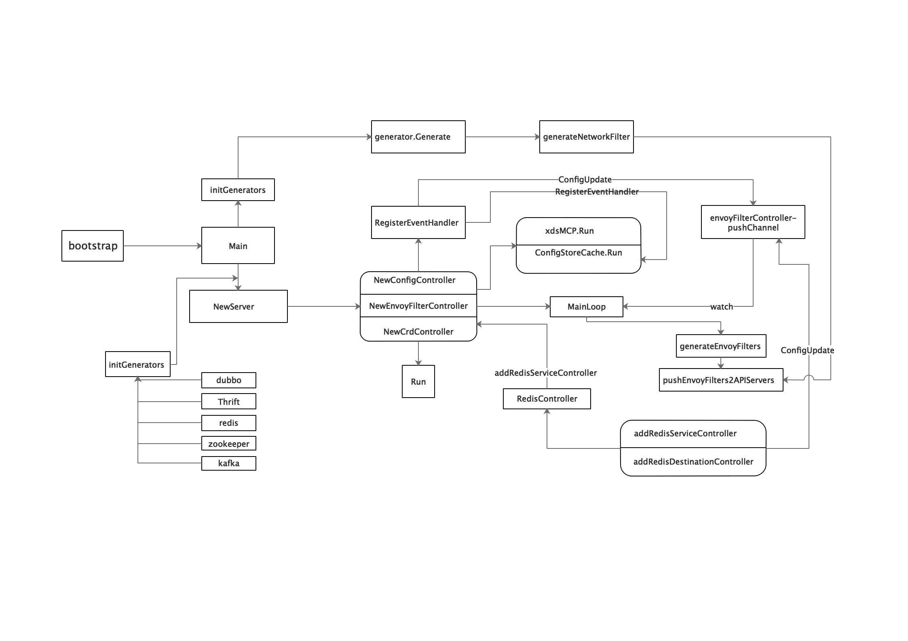

# Aeraki分析


## 整体架构


简单来讲，`Aeraki` 就是来帮助我们去生成[envoyfilter](../../istio-concepts/crd/EnvoyFilter.md)，即EnvoyFilter的模版生成、转换、管理插件。对于`Thrift` 和 `Dubbo` 这样的 RPC 协议（语义和 HTTP 类似），`Aeraki `沿用其原生的CRD ： [VirtualService](../../istio-concepts/crd/VirtualService.md) 和 [DestinationRule](../../istio-concepts/crd/DestinationRule.md)，并根据CRD定义的路由规则和流量规则去生成对应的EnvoyFilter；对于非 RPC 协议，`Aeraki` 则定义了一些新的 CRD 来进行管理，例如针对redis服务定义了 RedisService 和 RedisDestination并根据里面的定义去生成对应的EnvoyFilter。


## 代码设计


### 代码目录

```shell
.
├── README.md						# README文档
├── cmd
│   └── aeraki						# main函数入口
├── common-protos					# 一些pb相关的
├── demo							# aeraki提供的服务样例yaml文件
│   ├── aeraki-demo.json			# grafana导出的配置
│   ├── dubbo						# dubbo服务的yaml，包括dubbo的deployment，destinationRule，virtualService，serviceEntry
│   ├── gateway						# kiali,prometheus,grafana的一些gateway，service
│   ├── install-demo.sh				# 安装aeraki脚本(包括istio、kiali、prometheus、grafana、dubbo、thrift、kafka等)
│   ├── kafka						# kafka相关脚本
│   ├── thrift						# thrift相关yaml
│   └── uninstall-demo.sh			# 卸载脚本
├── docker
│   └── Dockerfile					# aeraki的dockerfile
├── docs							# 文档
├── go.mod
├── go.sum
├── k8s
│   └── aeraki.yaml					# aeraki的yaml文件
├── pkg								# aeraki的核心代码
│   ├── bootstrap					# aeraki的server代码
│   ├── config						# configController 监听Istio config xDS server的配置变更
│   ├── envoyfilter					# envoyFilterController 生成对应的envoyFilter
│   ├── kube						#	与k8s的apiserve的交互
│   └── model						# 一些定义还有协议的识别（根据PortName）
├── plugin							# 各个协议插件对应的Generator实例实现
│   ├── dubbo
│   ├── kafka
│   ├── redis
│   ├── thrift
│   └── zookeeper
├── test 							# 一些yaml文件与脚本
└── vendor						    # vendor
```


## 整体流程




### 核心代码

#### 初始化

服务的main函数总入口，主要是去加载各个协议的Generators还有做一些日志的初始化工作，开启aeraki的server端。

```go
//------------------source: aeraki/cmd/aeraki/main.go-------------------------//
func main() {
   args := bootstrap.NewAerakiArgs()
   args.IstiodAddr = *flag.String("istiodaddr", defaultIstiodAddr, "Istiod xds server address")
   args.Namespace = *flag.String("namespace", defaultNamespace, "Current namespace")
   args.ElectionID = *flag.String("electionID", defaultElectionID, "ElectionID to elect master controller")
   args.LogLevel = *flag.String("logLevel", defaultLogLevel, "Component log level")
   flag.Parse()
   setLogLevels(args.LogLevel)
   // Create the stop channel for all of the servers.
   stopChan := make(chan struct{}, 1)
   args.Protocols = initGenerators()
   server := bootstrap.NewServer(args)
   server.Start(stopChan)

   signalChan := make(chan os.Signal, 1)
   signal.Notify(signalChan, syscall.SIGINT, syscall.SIGTERM)
   <-signalChan
   stopChan <- struct{}{}
}

func initGenerators() map[protocol.Instance]envoyfilter.Generator {
   return map[protocol.Instance]envoyfilter.Generator{
      protocol.Dubbo:     dubbo.NewGenerator(),
      protocol.Thrift:    thrift.NewGenerator(),
      protocol.Kafka:     kafka.NewGenerator(),
      protocol.Zookeeper: zookeeper.NewGenerator(),
   }
}
```

#### bootstrap

aeraki的server结构主要包括了本身运行的一些配置args还有就是几个controller。

```go
//------------------source: aeraki/pkg/bootstrap/server.go-----------------------//
type Server struct {
	args                  *AerakiArgs
	configController      *config.Controller				// configController监听istio配置变更
	envoyFilterController *envoyfilter.Controller			// 生成envoyfilter的controller
	crdController         manager.Manager					// 管理自定义crd的controller
	stopCRDController     func()	
}

// Aeraki运行需要的参数
type AerakiArgs struct {
	IstiodAddr string		
	ListenAddr string
	Namespace  string
	ElectionID string
	LogLevel   string
	Protocols  map[protocol.Instance]envoyfilter.Generator
}


// 新建server实例，初始化各个controller
func NewServer(args *AerakiArgs) *Server {
    // configController实例化
	configController := config.NewController(args.IstiodAddr)			
    // envoyFilterController实例化
	envoyFilterController := envoyfilter.NewController(configController.Store, args.Protocols)
    // crdController实例化
	crdController := controller.NewManager(args.Namespace, args.ElectionID, func() error {
        // 自定义的CRD资源由更新也会交给envoyFilterController去对应处理
		envoyFilterController.ConfigUpdate(model.EventUpdate)
		return nil
	})

	cfg := crdController.GetConfig()
	args.Protocols[protocol.Redis] = redis.New(cfg, configController.Store)

    // configController事件处理handler，如果有配置添加/更新/删除则交给envoyFilterController去对应处理
	configController.RegisterEventHandler(args.Protocols, func(_, curr istioconfig.Config, event model.Event) {
		// 往envoyFilterController的pushChannel写入event
        envoyFilterController.ConfigUpdate(event)
	})

	return &Server{
		args:                  args,
		configController:      configController,
		envoyFilterController: envoyFilterController,
		crdController:         crdController,
	}
}

// Start starts all components of the Aeraki service. Serving can be canceled at any time by closing the provided stop channel.
// This method won't block
func (s *Server) Start(stop <-chan struct{}) {
	aerakiLog.Info("Staring Aeraki Server")

	go func() {
		aerakiLog.Infof("Starting Envoy Filter Controller")
		s.envoyFilterController.Run(stop)
	}()

	go func() {
		aerakiLog.Infof("Watching xDS resource changes at %s", s.args.IstiodAddr)
		s.configController.Run(stop)
	}()

	ctx, cancel := context.WithCancel(context.Background())
	s.stopCRDController = cancel
	go func() {
		_ = s.crdController.Start(ctx)
	}()

	s.waitForShutdown(stop)
}
```


#### configController

configController主要就是监听istio的配置ServiceEntry、VirtualService、DestinationRule变化，依赖了istio的[xds-mcp-api](https://github.com/istio/api/tree/master/mcp).

```go
//------------------source: aeraki/pkg/config/configcontroller.go-----------------------//
// Controller watches Istio config xDS server and notifies the listeners when config changes.
type Controller struct {
	configServerAddr string
	Store            istiomodel.ConfigStore			  // istiomodel => istio.io/istio/pilot/pkg/model
	controller       istiomodel.ConfigStoreCache	  // 监控ConfigStore
}

func (c *Controller) Run(stop <-chan struct{}) {
	go func() {
		for {
			// 拿到istio的xdsMCP
			xdsMCP, err := adsc.New(c.configServerAddr, &adsc.Config{
				Meta: istiomodel.NodeMetadata{
					Generator: "api",
				}.ToStruct(),
				InitialDiscoveryRequests: c.configInitialRequests(),
				BackoffPolicy:            backoff.NewConstantBackOff(time.Second),
			})
      
			if err != nil {
				controllerLog.Errorf("failed to dial XDS %s %v", c.configServerAddr, err)
				time.Sleep(5 * time.Second)
				continue
			}
      
			xdsMCP.Store = istiomodel.MakeIstioStore(c.controller)
			if err = xdsMCP.Run(); err != nil {
				controllerLog.Errorf("adsc: failed running %v", err)
				time.Sleep(5 * time.Second)
				continue
			}
			c.controller.Run(stop)
			return
		}
	}()
}
```

configController中的controller就是监控istio-ConfigStore的变化，有更新则会通过eventChanel通知

```go
//------------------source: istio.io/istio/pilot/pkg/config/memory/controller.go---------------//
type controller struct {
	monitor     Monitor
	configStore model.ConfigStore
}

// NewController return an implementation of model.ConfigStoreCache
// This is a client-side monitor that dispatches events as the changes are being
// made on the client.
func NewController(cs model.ConfigStore) model.ConfigStoreCache {
	out := &controller{
		configStore: cs,
		monitor:     NewMonitor(cs),
	}
	return out
}

func (c *controller) Run(stop <-chan struct{}) {
	c.monitor.Run(stop)
}
 
//------------------source: istio.io/istio/pilot/pkg/config/memory/monitor.go---------------------//
// Monitor provides methods of manipulating changes in the config store
type Monitor interface {
	Run(<-chan struct{})
	AppendEventHandler(config2.GroupVersionKind, Handler)
	ScheduleProcessEvent(ConfigEvent)
}

func NewMonitor(store model.ConfigStore) Monitor {
	return newBufferedMonitor(store, BufferSize, false)
}

func (m *configstoreMonitor) Run(stop <-chan struct{}) {
	if m.sync {
		<-stop
		return
	}
	for {
		select {
		case <-stop:
			return
		case ce, ok := <-m.eventCh:
			if ok {
                // eventChannel的event处理
				m.processConfigEvent(ce)
			}
		}
	}
}

func (m *configstoreMonitor) processConfigEvent(ce ConfigEvent) {
	if _, exists := m.handlers[ce.config.GroupVersionKind]; !exists {
		log.Warnf("Config GroupVersionKind %s does not exist in config store", ce.config.GroupVersionKind)
		return
	}
	m.applyHandlers(ce.old, ce.config, ce.event)
}
```

configController处理event的handler

```go
//------------------source: aeraki/pkg/config/configcontroller.go-----------------------//

// RegisterEventHandler adds a handler to receive config update events for a configuration type
func (c *Controller) RegisterEventHandler(protocols map[protocol.Instance]envoyfilter.Generator, 
                                          handler   func(istioconfig.Config, istioconfig.Config, istiomodel.Event)) {
  
  
	handlerWrapper := func(prev istioconfig.Config, curr istioconfig.Config, event istiomodel.Event) {
		if event == istiomodel.EventUpdate && reflect.DeepEqual(prev.Spec, curr.Spec) {
			return
		}
    
		// ServiceEntry有变动
		if curr.GroupVersionKind == collections.IstioNetworkingV1Alpha3Serviceentries.Resource().GroupVersionKind() {
			service, ok := curr.Spec.(*networking.ServiceEntry)
			if !ok {
				// This should never happen，断言为ServiceEntry失败，不可能发生
				controllerLog.Errorf("Failed in getting a virtual service: %v", curr.Name)
				return
			}
      
            // 通过portName来识别对应的协议，必须以tcp-protocol-serviceXXX命名
			for _, port := range service.Ports {
				if !strings.HasPrefix(port.Name, "tcp") {
					continue
				}
				if _, ok := protocols[protocol.GetLayer7ProtocolFromPortName(port.Name)]; ok {
					controllerLog.Infof("Matched protocol :%s %s %s", protocol.GetLayer7ProtocolFromPortName(port.Name), event.String(), curr.Name)
                    // 执行对应的handler
					handler(prev, curr, event)
				}
			}
		} else if curr.GroupVersionKind == collections.IstioNetworkingV1Alpha3Virtualservices.Resource().GroupVersionKind() {
			// VirtualService有变动
			controllerLog.Infof("Virtual Service changed: %s %s", event.String(), curr.Name)
			vs, ok := curr.Spec.(*networking.VirtualService)
			if !ok {
				// This should never happen
				controllerLog.Errorf("Failed in getting a virtual service: %v", event.String(), curr.Name)
				return
			}
            // 获取所有的serviceEntries
			serviceEntries, err := c.Store.List(collections.IstioNetworkingV1Alpha3Serviceentries.Resource().GroupVersionKind(), "")
			if err != nil {
				controllerLog.Errorf("Failed to list configs: %v", err)
				return
			}
			for _, config := range serviceEntries {
				service, ok := config.Spec.(*networking.ServiceEntry)
        
				if !ok { // should never happen
					controllerLog.Errorf("failed in getting a service entry: %s: %v", config.Labels, err)
					return
				}
				if len(service.Hosts) > 0 {
					for _, host := range service.Hosts {
                        // 与virtualService中的host匹配上了，执行对应的handler
						if host == vs.Hosts[0] {
							for _, port := range service.Ports {
								if _, ok := protocols[protocol.GetLayer7ProtocolFromPortName(port.Name)]; ok {
									handler(prev, curr, event)
								}
							}
						}
					}
				}
			}
		}
	}

	schemas := configCollection.All()
	for _, schema := range schemas {
        // 在event处理过程中注入handlerWrapper
		c.controller.RegisterEventHandler(schema.Resource().GroupVersionKind(), handlerWrapper)
	}
}
```


#### envoyFilterController

envoyFilter的结构包含了istio的ConfigStore，主要是用来获取istio的crd配置去生成envotFilter；generators则是各个协议插件的实现；pushchannel为event的channel，server启动后configController监听到配置变更后会往其中写入event。

```go
//------------------source: aeraki/pkg/envoyfilter/controller.go-----------------------//

// Controller contains the runtime configuration for the envoyFilter controller.
type Controller struct {
	configStore istiomodel.ConfigStore
	generators  map[protocol.Instance]Generator
	// server的RegisterEventHandler会往channel中写入event
	pushChannel chan istiomodel.Event
}

func (s *Controller) Run(stop <-chan struct{}) {
	go func() {
		s.mainLoop(stop)
	}()
}

const (
	// debounceAfter is the delay added to events to wait after a registry event for debouncing.
	// This will delay the push by at least this interval, plus the time getting subsequent events.
	// If no change is detected the push will happen, otherwise we'll keep delaying until things settle.
	debounceAfter = 500 * time.Millisecond

	// debounceMax is the maximum time to wait for events while debouncing.
	// Defaults to 10 seconds. If events keep showing up with no break for this time, we'll trigger a push.
	debounceMax = 10 * time.Second
)


func (s *Controller) mainLoop(stop <-chan struct{}) {
	var timeChan <-chan time.Time
	var startDebounce time.Time
	var lastResourceUpdateTime time.Time
	pushCounter := 0
	debouncedEvents := 0
  
	for {
		select {
		case <-stop:
			break
		case e := <-s.pushChannel:
			controllerLog.Debugf("Receive event from push chanel : %v", e)
			lastResourceUpdateTime = time.Now()
			if debouncedEvents == 0 {
				controllerLog.Debugf("This is the first debounced event")
				startDebounce = lastResourceUpdateTime
			}
			timeChan = time.After(debounceAfter)
			debouncedEvents++
		case <-timeChan:
			controllerLog.Debugf("Receive event from time chanel")
			eventDelay := time.Since(startDebounce)
			quietTime := time.Since(lastResourceUpdateTime)
			// it has been too long since the first debounced event or quiet enough since the last debounced event
			if eventDelay >= debounceMax || quietTime >= debounceAfter {
				if debouncedEvents > 0 {
					pushCounter++
					controllerLog.Infof("Push debounce stable[%d] %d: %v since last change, %v since last push",
						pushCounter, debouncedEvents, quietTime, eventDelay)
					// 推送envoyFilter到k8s的apiserver
					err := s.pushEnvoyFilters2APIServer()
					if err != nil {
                        // 有错误重新加到push-Channel重试
						controllerLog.Errorf("%v", err)
						// Retry if failed to push envoyFilters to APIServer
						s.ConfigUpdate(istiomodel.EventUpdate)
					}
					debouncedEvents = 0
				}
			} else {
				timeChan = time.After(debounceAfter - quietTime)
			}
		}
	}
}
```


生成envoyFilter和推送到k8s的apiserver核心代码：

```go
//------------------source: aeraki/pkg/envoyfilter/controller.go-----------------------//
// 生成envoyFilter
func (s *Controller) generateEnvoyFilters() (map[string]*model.EnvoyFilterWrapper, error) {
  
	envoyFilters := make(map[string]*model.EnvoyFilterWrapper)
    // 获取serviceEntries
	serviceEntries, err := s.configStore.List(collections.IstioNetworkingV1Alpha3Serviceentries.Resource().GroupVersionKind(), "")
	if err != nil {
		return envoyFilters, fmt.Errorf("failed to list configs: %v", err)
	}

	for _, config := range serviceEntries {
		service, ok := config.Spec.(*networking.ServiceEntry)
		if !ok { // should never happen
			return envoyFilters, fmt.Errorf("failed in getting a service entry: %s: %v", config.Labels, err)
		}

		if len(service.Hosts) == 0 {
			controllerLog.Errorf("host should not be empty: %s", config.Name)
			// We can't retry in this scenario
			return envoyFilters, nil
		}
		if len(service.Hosts) > 1 {
			controllerLog.Warnf("multiple hosts found for service: %s, only the first one will be processed", config.Name)
		}

        // 也是根据host去找到相关的VirtualService
		relatedVs, err := s.findRelatedVirtualService(service)
		if err != nil {
			return envoyFilters, fmt.Errorf("failed in finding the related virtual service : %s: %v", config.Name, err)
		}
    
		// 开始生成EnvoyFilter
		context := &model.EnvoyFilterContext{
			ServiceEntry: &model.ServiceEntryWrapper{
				Meta: config.Meta,
				Spec: service,
			},
			VirtualService: relatedVs,
		}
    
		for _, port := range service.Ports {
			instance := protocol.GetLayer7ProtocolFromPortName(port.Name)
			if generator, ok := s.generators[instance]; ok {
                // 由各个协议的generator去处理
				envoyFilterWrappers := generator.Generate(context)
				for _, wrapper := range envoyFilterWrappers {
					envoyFilters[wrapper.Name] = wrapper
				}
				break
			}
		}
	}
	return envoyFilters, nil
}

// 推送到APIserver
func (s *Controller) pushEnvoyFilters2APIServer() error {
	generatedEnvoyFilters, err := s.generateEnvoyFilters()
	if err != nil {
		return fmt.Errorf("failed to generate EnvoyFilter: %v", err)
	}

	config, err := config.GetConfig()
	if err != nil {
		return fmt.Errorf("can not get kubernetes config: %v", err)
	}

	ic, err := versionedclient.NewForConfig(config)
	if err != nil {
		return fmt.Errorf("failed to create istio client: %v", err)
	}

  	// 获取原先存在的envoyFilter
	existingEnvoyFilters, _ := ic.NetworkingV1alpha3().EnvoyFilters(configRootNS).List(context.TODO(), v1.ListOptions{
		LabelSelector: "manager=" + aerakiFieldManager,
	})

	for _, oldEnvoyFilter := range existingEnvoyFilters.Items {
        // 删除
		if newEnvoyFilter, ok := generatedEnvoyFilters[oldEnvoyFilter.Name]; !ok {
			controllerLog.Infof("Deleting EnvoyFilter: %v", oldEnvoyFilter)
			err = ic.NetworkingV1alpha3().EnvoyFilters(configRootNS).Delete(context.TODO(), oldEnvoyFilter.Name,
				v1.DeleteOptions{})
			if err != nil {
				err = fmt.Errorf("failed to create istio client: %v", err)
			}
		} else {
            // 更新
			if !proto.Equal(newEnvoyFilter.Envoyfilter, &oldEnvoyFilter.Spec) {
				controllerLog.Infof("Updating EnvoyFilter: %v", *newEnvoyFilter.Envoyfilter)
				_, err = ic.NetworkingV1alpha3().EnvoyFilters(configRootNS).Update(context.TODO(),
					s.toEnvoyFilterCRD(newEnvoyFilter, &oldEnvoyFilter),
					v1.UpdateOptions{FieldManager: aerakiFieldManager})
				if err != nil {
					err = fmt.Errorf("failed to update EnvoyFilter: %v", err)
				}
			} else {
                 // 无变更
				controllerLog.Infof("EnvoyFilter: %s unchanged", oldEnvoyFilter.Name)
			}
			delete(generatedEnvoyFilters, oldEnvoyFilter.Name)
		}
	}
	// 剩下的是之前不存在的则新增
	for _, wrapper := range generatedEnvoyFilters {
		_, err = ic.NetworkingV1alpha3().EnvoyFilters(configRootNS).Create(context.TODO(), s.toEnvoyFilterCRD(wrapper, nil),
			v1.CreateOptions{FieldManager: aerakiFieldManager})
		controllerLog.Infof("Creating EnvoyFilter: %v", *wrapper.Envoyfilter)
		if err != nil {
			err = fmt.Errorf("failed to create EnvoyFilter: %v", err)
		}
	}
	return err
}

```


#### Generators

generator是每个协议生成envoyFilter配置的接口，要适配的协议生成对应的Generate方法即可

```go
//------------------source: aeraki/pkg/envoyfilter/generator.go-----------------------//

// Generator generates protocol specified envoyfilters
type Generator interface {
	Generate(context *model.EnvoyFilterContext) []*model.EnvoyFilterWrapper
}


//------------------source: aeraki/pkg/envoyfilter/network_filter.go-----------------------//
// network_filter 通用的生成envoyFilter方法
func generateNetworkFilter(service *networking.ServiceEntry, outboundProxy proto.Message,
	inboundProxy proto.Message, filterName string, filterType string, operation networking.EnvoyFilter_Patch_Operation) []*model.EnvoyFilterWrapper {
	var outboundProxyPatch, inboundProxyPatch *networking.EnvoyFilter_EnvoyConfigObjectPatch
	if outboundProxy != nil {
		outboundProxyStruct, err := generateValue(outboundProxy, filterName, filterType)
		if err != nil {
			//This should not happen
			generatorLog.Errorf("Failed to generate outbound EnvoyFilter: %v", err)
			return nil
		}
		outboundListenerName := service.GetAddresses()[0] + "_" + strconv.Itoa(int(service.Ports[0].Number))
		outboundProxyPatch = &networking.EnvoyFilter_EnvoyConfigObjectPatch{
			ApplyTo: networking.EnvoyFilter_NETWORK_FILTER,
			Match: &networking.EnvoyFilter_EnvoyConfigObjectMatch{
				ObjectTypes: &networking.EnvoyFilter_EnvoyConfigObjectMatch_Listener{
					Listener: &networking.EnvoyFilter_ListenerMatch{
						Name: outboundListenerName,
						FilterChain: &networking.EnvoyFilter_ListenerMatch_FilterChainMatch{
							Filter: &networking.EnvoyFilter_ListenerMatch_FilterMatch{
								Name: wellknown.TCPProxy,
							},
						},
					},
				},
			},
			Patch: &networking.EnvoyFilter_Patch{
				Operation: operation,
				Value:     outboundProxyStruct,
			},
		}
	}

	if inboundProxy != nil {
		inboundProxyStruct, err := generateValue(inboundProxy, filterName, filterType)
		if err != nil {
			//This should not happen
			generatorLog.Errorf("Failed to generate inbound EnvoyFilter: %v", err)
			return nil
		}

		inboundProxyPatch = &networking.EnvoyFilter_EnvoyConfigObjectPatch{
			ApplyTo: networking.EnvoyFilter_NETWORK_FILTER,
			Match: &networking.EnvoyFilter_EnvoyConfigObjectMatch{
				ObjectTypes: &networking.EnvoyFilter_EnvoyConfigObjectMatch_Listener{
					Listener: &networking.EnvoyFilter_ListenerMatch{
						Name: "virtualInbound",
						FilterChain: &networking.EnvoyFilter_ListenerMatch_FilterChainMatch{
							DestinationPort: service.Ports[0].Number,
							Filter: &networking.EnvoyFilter_ListenerMatch_FilterMatch{
								Name: wellknown.TCPProxy,
							},
						},
					},
				},
			},
			Patch: &networking.EnvoyFilter_Patch{
				Operation: operation,
				Value:     inboundProxyStruct,
			},
		}
	}

	if outboundProxyPatch != nil && inboundProxyPatch != nil {
		return []*model.EnvoyFilterWrapper{
			{
				Name: outboundEnvoyFilterName(service),
				Envoyfilter: &networking.EnvoyFilter{
					ConfigPatches: []*networking.EnvoyFilter_EnvoyConfigObjectPatch{outboundProxyPatch},
				},
			},
			{
				Name: inboundEnvoyFilterName(service),
				Envoyfilter: &networking.EnvoyFilter{
					WorkloadSelector: service.WorkloadSelector,
					ConfigPatches:    []*networking.EnvoyFilter_EnvoyConfigObjectPatch{inboundProxyPatch},
				},
			}}
	}
	if outboundProxyPatch != nil {
		return []*model.EnvoyFilterWrapper{
			{
				Name: outboundEnvoyFilterName(service),
				Envoyfilter: &networking.EnvoyFilter{
					ConfigPatches: []*networking.EnvoyFilter_EnvoyConfigObjectPatch{outboundProxyPatch},
				},
			}}
	}
	if inboundProxyPatch != nil {
		return []*model.EnvoyFilterWrapper{
			{
				Name: inboundEnvoyFilterName(service),
				Envoyfilter: &networking.EnvoyFilter{
					WorkloadSelector: service.WorkloadSelector,
					ConfigPatches:    []*networking.EnvoyFilter_EnvoyConfigObjectPatch{inboundProxyPatch},
				},
			}}
	}
	return nil
}
```

各个协议的支持还是要看envoy，以dubbo的generator为例，envoy的dubbo-router文档：https://www.envoyproxy.io/docs/envoy/latest/api-v3/extensions/filters/network/dubbo_proxy/v3/route.proto#envoy-v3-api-msg-extensions-filters-network-dubbo-proxy-v3-routeconfiguration

```go
// Generate create EnvoyFilters for Dubbo services
func (*Generator) Generate(context *model.EnvoyFilterContext) []*model.EnvoyFilterWrapper {
	return envoyfilter.GenerateReplaceNetworkFilter(
		context.ServiceEntry.Spec,
		buildOutboundProxy(context),
		buildInboundProxy(context),
		"envoy.filters.network.dubbo_proxy",
		"type.googleapis.com/envoy.extensions.filters.network.dubbo_proxy.v3.DubboProxy")
}

// 以OutboundProxy为例，生成envoy需要的dubbo路由配置
func buildOutboundProxy(context *model.EnvoyFilterContext) *dubbo.DubboProxy {
	route, err := buildOutboundRouteConfig(context)
	if err != nil {
		generatorLog.Errorf("Failed to generate Dubbo EnvoyFilter: %v, %v", context.ServiceEntry, err)
		return nil
	}

	return &dubbo.DubboProxy{
		StatPrefix: model.BuildClusterName(model.TrafficDirectionOutbound, "",
			context.ServiceEntry.Spec.Hosts[0], int(context.ServiceEntry.Spec.Ports[0].Number)),
		ProtocolType:      dubbo.ProtocolType_Dubbo,
		SerializationType: dubbo.SerializationType_Hessian2,
		// we only support one to one mapping of interface and service. If there're multiple interfaces in one process,
		// these interfaces can be defined in separated services, one service for one interface.
		RouteConfig: []*dubbo.RouteConfiguration{
			route,
		},
	}
}


func buildOutboundRouteConfig(context *model.EnvoyFilterContext) (*dubbo.RouteConfiguration, error) {
	// dubbo service interface should be passed in via serviceentry annotation
	var serviceInterface string
	var exist bool
	if serviceInterface, exist = context.ServiceEntry.Annotations["interface"]; !exist {
		err := fmt.Errorf("no interface annotation")
		return nil, err
	}

	var route []*dubbo.Route
	clusterName := model.BuildClusterName(model.TrafficDirectionOutbound, "", context.ServiceEntry.Spec.Hosts[0], int(context.ServiceEntry.Spec.Ports[0].Number))

	if context.VirtualService == nil {
		route = []*dubbo.Route{defaultRoute(clusterName)}
	} else {
		route = buildRoute(context)
	}

	return &dubbo.RouteConfiguration{
		Name:      clusterName,
		Interface: serviceInterface, // To make this work, Dubbo Interface should have been registered to the Istio service registry as a service
		Routes:    route,
	}, nil
}
```

其他协议的支持对照envoy需要的配置去生成对应的envoyFilter配置。


#### crdController

对于redis协议，aeraki是使用了自定义的crd，所以crdController是用来管理crd自定义资源的，并监听crd变化则执行对应的triggerPush（envoyFilterController.ConfigUpdate）

```go
//------------------source: aeraki/pkg/kube/controller/controller.go-----------------------//
func NewManager(namespace string, electionID string, triggerPush func() error) manager.Manager {
	// Get a config to talk to the apiserver
	cfg, err := config.GetConfig()
	if err != nil {
		controllerLog.Fatalf("Could not get apiserver config: %v\n", err)
		return nil
	}
	mgrOpt := manager.Options{
		MetricsBindAddress:      "0",
		LeaderElection:          true,
		LeaderElectionNamespace: namespace,
		LeaderElectionID:        electionID,
	}
	m, err := manager.New(cfg, mgrOpt)
	if err != nil {
		controllerLog.Fatalf("Could not create a controller manager: %v", err)
		return nil
	}

	err = addRedisServiceController(m, triggerPush)
	if err != nil {
		controllerLog.Fatalf("Could not add RedisServiceController: %e", err)
		return nil
	}
	err = addRedisDestinationController(m, triggerPush)
	if err != nil {
		controllerLog.Fatalf("Could not add RedisDestinationController: %e", err)
		return nil
	}
	err = scheme.AddToScheme(m.GetScheme())
	if err != nil {
		controllerLog.Fatalf("Could not add schema: %e", err)
	}
	return m
}

//------------------source: aeraki/pkg/envoyfilter/redis.go-----------------------//
// 以redis的destination为例
func addRedisDestinationController(mgr manager.Manager, triggerPush func() error) error {
	redisCtrl := &RedisController{triggerPush: triggerPush}
	c, err := controller.New("aeraki-redis-destination-controller", mgr, controller.Options{Reconciler: redisCtrl})
	if err != nil {
		return err
	}
	// Watch for changes to primary resource IstioFilter
	err = c.Watch(&source.Kind{Type: &v1alpha1.RedisDestination{}}, &handler.EnqueueRequestForObject{}, redisPredicates)
	if err != nil {
		return err
	}
	controllerLog.Infof("RedisDestinationController registered")
	return nil
}
```


